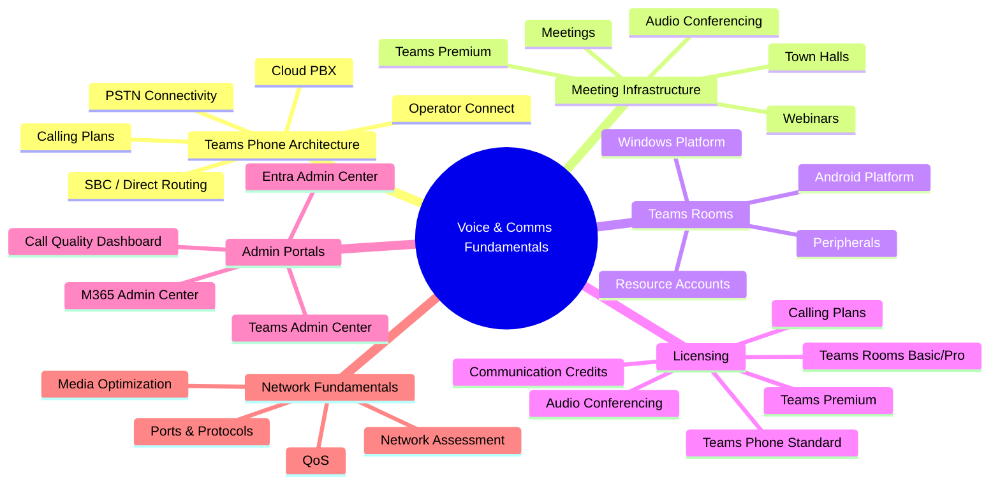
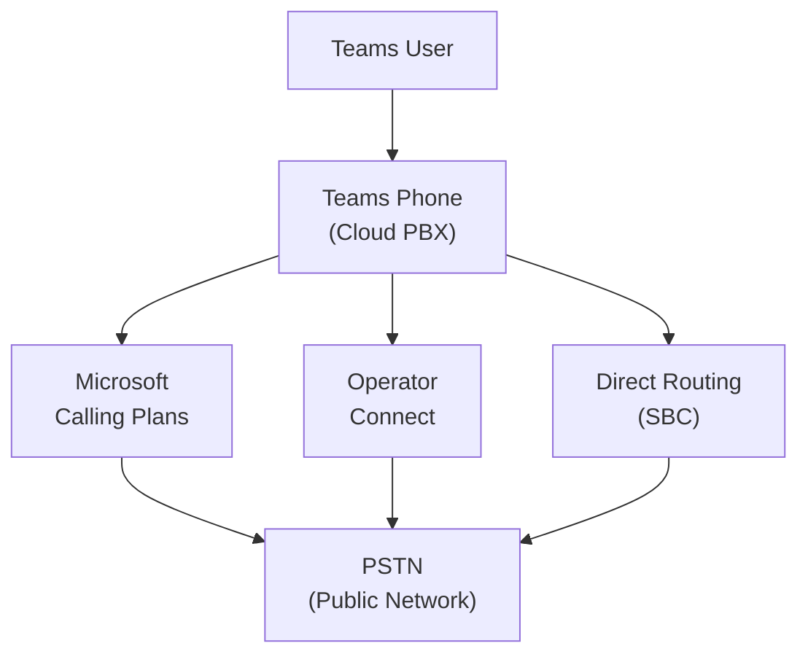
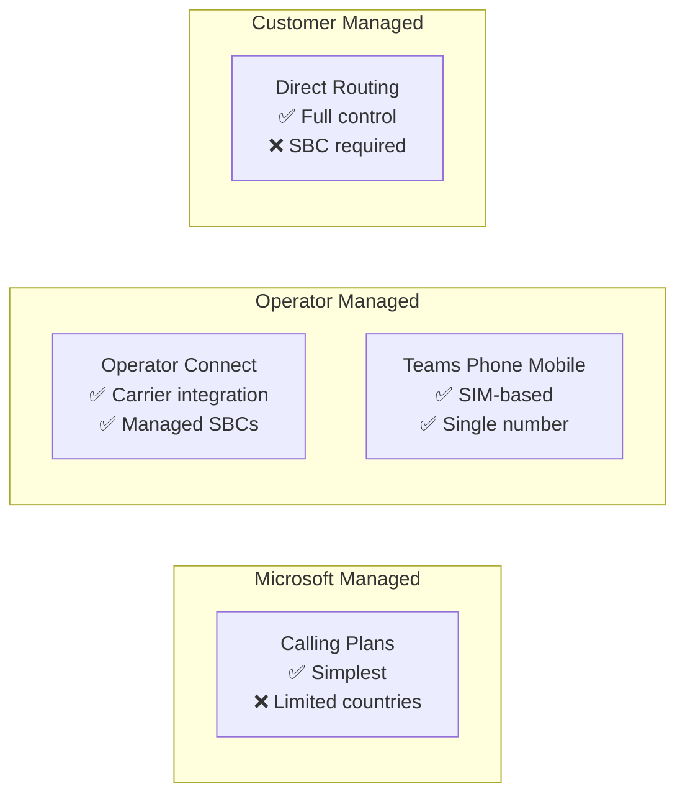

# 00 — Teams Voice & Communications Fundamentals
> - Based on: *[Microsoft Teams Admin Documentation](https://learn.microsoft.com/en-us/MicrosoftTeams/)*
> - 📁 [← Back to Home](/ms-721-study-notes/)

---

## 🗺 Overview



---

## 🏗️ Teams Phone Architecture

### How Teams Phone Works

Microsoft Teams Phone is a **cloud-based PBX** (Private Branch Exchange) that replaces traditional on-premises phone systems. It provides calling capabilities within Teams using Microsoft's cloud infrastructure.

| Component | Purpose |
|-----------|---------|
| **Teams Phone System** | Cloud PBX — call control, voicemail, auto attendants, call queues |
| **PSTN Connectivity** | Connects Teams Phone to the public telephone network |
| **Session Border Controller (SBC)** | Gateway between Teams and PSTN for Direct Routing |
| **Auto Attendants** | Automated call routing menus (IVR) |
| **Call Queues** | Hold and distribute calls to groups of agents |
| **Cloud Voicemail** | Voicemail with transcription, stored in Exchange Online |



> **⚠️ Exam Caveat:**
> - Teams Phone is the **cloud PBX component** — it does NOT include PSTN connectivity by itself
> - PSTN connectivity must be added separately via **Calling Plans**, **Operator Connect**, or **Direct Routing**
> - **Teams Phone Mobile** allows a user's SIM-enabled mobile number to be their Teams phone number

---

## 📞 PSTN Connectivity Options

| Option | Description | SBC Required? | Microsoft Manages PSTN? |
|--------|-------------|---------------|------------------------|
| **Microsoft Calling Plans** | Microsoft provides phone numbers and PSTN connectivity | **No** | **Yes** |
| **Operator Connect** | Telco operator provides PSTN via Microsoft-certified integration | **No** (operator-managed) | **No** |
| **Direct Routing** | Organization connects its own SBC to Teams Phone | **Yes** | **No** |
| **Teams Phone Mobile** | Mobile carrier provides PSTN via SIM-based number | **No** | **No** |



> **⚠️ Exam Caveat:**
> - **Calling Plans** are the simplest option but only available in [specific countries](https://learn.microsoft.com/en-us/MicrosoftTeams/country-and-region-availability-for-audio-conferencing-and-calling-plans/country-and-region-availability-for-audio-conferencing-and-calling-plans)
> - **Direct Routing** gives the most flexibility but requires an **SBC** and more complex configuration
> - **Operator Connect** is a middle ground — the operator manages the SBC infrastructure
> - Organizations can **mix connectivity methods** — e.g., Calling Plans for one region and Direct Routing for another

---

## 🎥 Meeting Types in Teams

| Meeting Type | Audience | Max Attendees | Key Features |
|-------------|----------|---------------|-------------|
| **Meeting** | Internal/external collaboration | **1,000** (up to 20,000 in view-only) | Breakout rooms, recording, transcription, Copilot |
| **Webinar** | Structured presentations with registration | **1,000** | Registration, presenter/attendee roles, engagement reports |
| **Town Hall** | Large-scale broadcast events | **10,000** (up to 20,000 with Teams Premium) | Q&A, eCDN support, producer controls |
| **Virtual Appointment** | External customer-facing meetings | **Varies** | SMS notifications, waiting room, custom branding |

> **⚠️ Exam Caveat:**
> - **Webinars** support registration and structured presenter roles — meetings do not
> - **Town halls** replace the legacy Live Events feature
> - **Teams Premium** extends capacity and adds advanced features (custom branding, watermarks, Copilot in meetings)
> - **Audio Conferencing** adds dial-in numbers to any meeting type

---

## 📜 Licensing Overview

### Core Licenses for Teams Phone

| License | What It Provides |
|---------|-----------------|
| **Teams Phone Standard** | Cloud PBX — auto attendants, call queues, voicemail, call park, transfer |
| **Microsoft Calling Plan** (Domestic/International) | PSTN connectivity and phone numbers via Microsoft |
| **Operator Connect** | PSTN via certified operator (operator provides license/numbers) |
| **Communication Credits** | Pay-per-minute for toll-free numbers and international dial-out |

### Plans That Include Teams Phone

| Plan | Teams Phone Included? | Audio Conferencing Included? |
|------|----------------------|----------------------------|
| **Microsoft 365 E5** | **Yes** | **Yes** |
| **Microsoft 365 E3** | **No** — add Teams Phone Standard | **No** — add separately |
| **Microsoft 365 E1** | **No** — add Teams Phone Standard | **No** — add separately |
| **Microsoft 365 Business Premium** | **No** — add Teams Phone Standard | **No** — add separately |
| **Microsoft 365 F1/F3** | **No** — add Teams Phone Standard | **No** — add separately |

### Teams Rooms Licensing

| License | Features |
|---------|----------|
| **Teams Rooms Basic** | Free for up to 25 rooms — join meetings, screen sharing, whiteboard |
| **Teams Rooms Pro** | Unlimited rooms — remote management, advanced analytics, Intune enrollment, Copilot |

> **⚠️ Exam Caveat:**
> - **M365 E5** is the only standard plan that includes **both** Teams Phone and Audio Conferencing
> - **Teams Rooms Basic** is limited to **25 rooms per tenant** — beyond that, you need Teams Rooms Pro
> - **Resource accounts** for auto attendants/call queues need a **Teams Phone Resource Account** license (free) plus a **Calling Plan** or virtual user license if they need a phone number
> - **Communication Credits** are required for toll-free Audio Conferencing dial-in numbers

---

## 🖥️ Admin Portals

| Portal | URL | Primary Use for MS-721 |
|--------|-----|----------------------|
| **Teams Admin Center** | admin.teams.microsoft.com | Phone policies, meeting policies, device management, auto attendants, call queues |
| **M365 Admin Center** | admin.microsoft.com | User/license management, service health |
| **Microsoft Entra Admin Center** | entra.microsoft.com | Identity, Conditional Access, resource account management |
| **Call Quality Dashboard (CQD)** | cqd.teams.microsoft.com | Tenant-wide call quality analytics and reporting |
| **Teams Rooms Pro Management** | portal.rooms.microsoft.com | Teams Rooms monitoring, alerts, and remote management |
| **Microsoft Intune** | intune.microsoft.com | Device compliance, configuration profiles for Teams devices |

> **⚠️ Exam Caveat:**
> - **Call Analytics** (per-user) is accessed from the **Teams Admin Center** under Users
> - **Call Quality Dashboard** (tenant-wide) is a separate portal at **cqd.teams.microsoft.com**
> - **Teams Rooms Pro Management portal** requires a **Teams Rooms Pro** license
> - **Phone number management** is done in the Teams Admin Center under Voice > Phone numbers

---

## 👤 Relevant Admin Roles

| Role | Scope |
|------|-------|
| **Teams Administrator** | Full access to Teams admin center — all Teams settings, policies, and devices |
| **Teams Communications Administrator** | Manages calling and meeting features — voice, phone numbers, meeting policies |
| **Teams Communications Support Engineer** | Access to advanced call analytics — all users, full telemetry |
| **Teams Communications Support Specialist** | Access to basic call analytics — per-user only |
| **Teams Devices Administrator** | Manages Teams device configuration and profiles |
| **Global Administrator** | Full access to everything (use sparingly — least-privilege principle) |

> **⚠️ Exam Caveat:**
> - **Teams Communications Administrator** can manage phone numbers, calling policies, and meeting settings
> - **Teams Devices Administrator** can manage device configuration but cannot change calling or meeting policies
> - The exam frequently tests **least-privilege** — choose the most restrictive role that can complete the task

---

## 🔧 PowerShell for Teams Phone

### Key Cmdlets

```powershell
# Install the module
Install-Module -Name MicrosoftTeams -Force

# Connect
Connect-MicrosoftTeams

# Phone number management
Get-CsPhoneNumberAssignment
Set-CsPhoneNumberAssignment -Identity user@domain.com -PhoneNumber "+14255551234" -PhoneNumberType DirectRouting

# Calling policies
Get-CsTeamsCallingPolicy
New-CsTeamsCallingPolicy -Identity "RestrictedCalling" -AllowPrivateCalling $true
Grant-CsTeamsCallingPolicy -Identity user@domain.com -PolicyName "RestrictedCalling"

# Auto attendants and call queues
Get-CsAutoAttendant
Get-CsCallQueue
New-CsOnlineApplicationInstance -UserPrincipalName aa@domain.com -DisplayName "Main Auto Attendant" -ApplicationId "ce933385-9390-45d1-9512-c8d228074e07"

# Direct Routing
Get-CsOnlinePSTNGateway
New-CsOnlinePSTNGateway -Fqdn "sbc.domain.com" -SipSignalingPort 5061 -Enabled $true
Get-CsOnlineVoiceRoute
Get-CsOnlineVoiceRoutingPolicy
```

### Application IDs

| Application | Application ID |
|-------------|---------------|
| **Auto Attendant** | `ce933385-9390-45d1-9512-c8d228074e07` |
| **Call Queue** | `11cd3e2e-fccb-42ad-ad00-878b93575e07` |

> **⚠️ Exam Caveat:**
> - **PowerShell** is required for bulk phone number assignments and advanced Direct Routing configuration
> - **Resource accounts** (application instances) use specific Application IDs — auto attendant and call queue have different IDs
> - `Set-CsPhoneNumberAssignment` replaces the deprecated `Set-CsUser` for phone number assignment

---

## 🌐 Network Fundamentals for Teams Voice

### Key Ports and Protocols

| Protocol | Port Range | Purpose |
|----------|-----------|---------|
| **HTTPS** | TCP 443 | Signaling, authentication, API calls |
| **STUN/TURN** | UDP 3478 | Media relay — NAT traversal |
| **Media** | UDP 3479–3481 | Audio, video, screen sharing |
| **SIP** | TCP/TLS 5061 | Direct Routing SBC signaling |

### Bandwidth Requirements (Per User)

| Scenario | Minimum Bandwidth |
|----------|-------------------|
| Audio call (1:1) | **~30 kbps** |
| Video call (1:1, 720p) | **~1.5 Mbps** |
| Video call (1:1, 1080p) | **~2.5 Mbps** |
| Screen sharing | **~200 kbps** |
| Large meeting (video gallery) | **~2.5–4 Mbps** |

### Quality of Service (QoS)

| Media Type | Source Port Range | DSCP Value | DSCP Class |
|-----------|-------------------|-----------|------------|
| **Audio** | 50000–50019 | **46** | **EF** (Expedited Forwarding) |
| **Video** | 50020–50039 | **34** | **AF41** |
| **App/Screen Sharing** | 50040–50059 | **18** | **AF21** |

> **⚠️ Exam Caveat:**
> - **UDP is preferred** for real-time media — if blocked, Teams falls back to TCP 443 with degraded quality
> - **Direct Routing SBCs** connect to Teams via **TLS on port 5061** — this is SIP signaling, not media
> - **QoS DSCP marking** is critical for prioritizing voice traffic — audio should always be **EF (46)**
> - Know the difference between **Network Planner** (capacity planning) and **Network Assessment Tool** (connectivity testing)

---

## 📚 Further Reading

| Resource | Link |
|----------|------|
| Teams Phone Overview | [Teams Phone Documentation](https://learn.microsoft.com/en-us/MicrosoftTeams/what-is-phone-system-in-office-365) |
| PSTN Connectivity Options | [PSTN Options](https://learn.microsoft.com/en-us/MicrosoftTeams/pstn-connectivity) |
| Teams Rooms Overview | [Teams Rooms Docs](https://learn.microsoft.com/en-us/MicrosoftTeams/rooms/) |
| Network Readiness | [Prepare Network for Teams](https://learn.microsoft.com/en-us/MicrosoftTeams/prepare-network) |
| Teams Licensing | [Teams Add-on Licensing](https://learn.microsoft.com/en-us/MicrosoftTeams/teams-add-on-licensing/microsoft-teams-add-on-licensing) |

---

[Next → 01 — Plan & Design Collaboration Communications Systems](/ms-721-study-notes/01-plan-design-systems/){: .btn .btn-primary .fs-5 }

[🏠 Home](/ms-721-study-notes/){: .btn .btn-outline .fs-3 }
