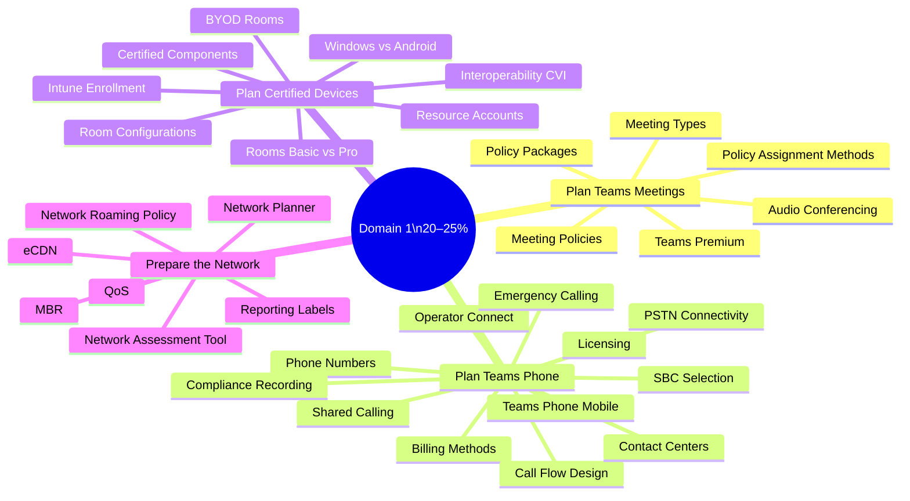
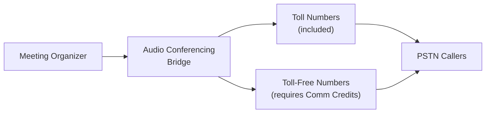
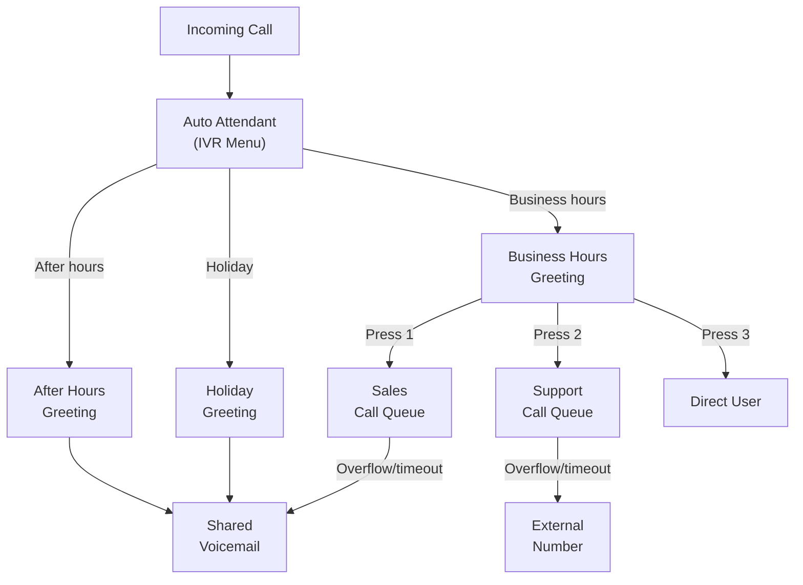
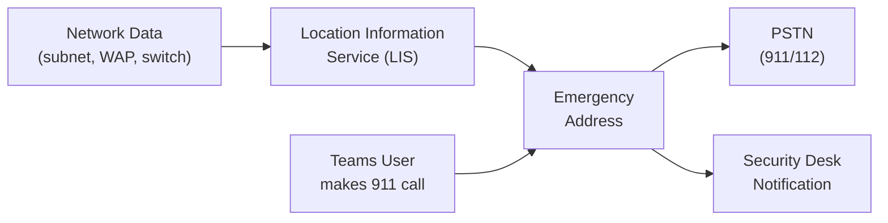
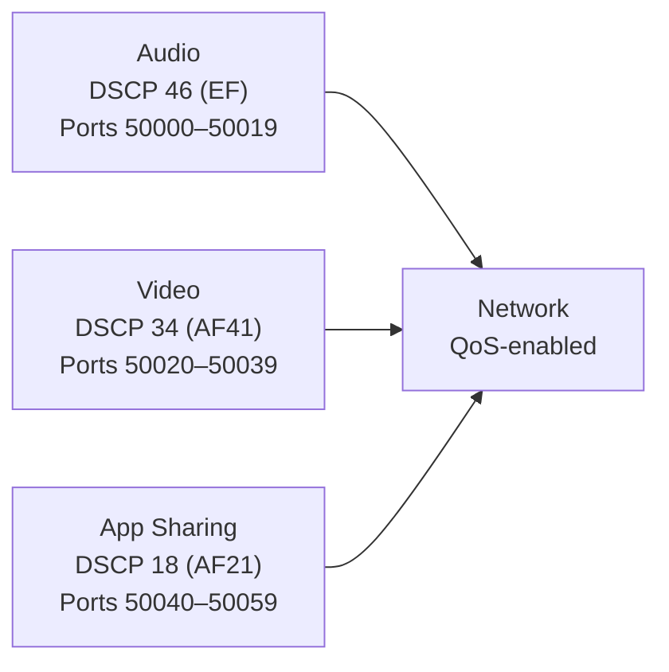

# 01 — Plan & Design Collaboration Communications Systems 20–25%
> - Based on: *[MS-721 Study Guide](https://learn.microsoft.com/en-us/credentials/certifications/resources/study-guides/ms-721)*
> - 📁 [← Back to Home](/ms-721-study-notes/)

---

## 🗺 Domain Overview

---

## 🎥 1.1 Plan and Design Teams Meetings

### Meeting Types Decision Matrix

| Requirement | Meeting | Webinar | Town Hall | Virtual Appointment |
|------------|---------|---------|-----------|-------------------|
| Interactive collaboration | ✅ | ❌ | ❌ | ✅ |
| Registration required | ❌ | ✅ | ❌ | ❌ |
| Large-scale broadcast | ❌ | ❌ | ✅ | ❌ |
| External customer-facing | ✅ | ✅ | ✅ | ✅ |
| Breakout rooms | ✅ | ❌ | ❌ | ❌ |
| Q&A feature | ✅ | ✅ | ✅ | ❌ |
| eCDN support | ❌ | ❌ | ✅ | ❌ |
| Max capacity | 1,000 | 1,000 | 10,000+ | Varies |

### Meeting Policies & Settings

Meeting policies control what features are available to meeting organizers and participants:

| Policy Setting | What It Controls |
|---------------|-----------------|
| **AllowMeetingRegistration** | Whether users can create webinars with registration |
| **AllowTranscription** | Live transcription in meetings |
| **AllowRecording** | Cloud recording capability |
| **AllowBreakoutRooms** | Breakout room creation |
| **AllowIPVideo** | Video in meetings |
| **MediaBitRateKb** | Maximum media bit rate for calls/meetings |
| **AllowMeetingCoach** | Speaker coach feature |
| **AllowWatermark** | Teams Premium watermark on video/shared content |

### PSTN Audio Conferencing

Audio Conferencing adds **dial-in phone numbers** to Teams meetings so participants can join via PSTN:

| Feature | Details |
|---------|---------|
| **Dedicated dial-in number** | Assigned per-user (default bridge number) |
| **Shared dial-in numbers** | Toll and toll-free numbers on the conference bridge |
| **Dial-out from meeting** | Call out to add PSTN participants |
| **Communication Credits** | Required for toll-free numbers and international dial-out |

> **⚠️ Exam Caveat:**
> - **Audio Conferencing** is included in M365 E5 but must be added separately for E3/E1
> - **Toll-free dial-in** requires **Communication Credits** to be set up
> - Each user gets a **default dial-in number** based on their usage location
> - **Dial-out policy** controls whether meeting organizers can dial out to PSTN numbers from meetings

### Teams Premium Features

| Feature | Requires Teams Premium? |
|---------|----------------------|
| Custom meeting branding | **Yes** |
| Watermarks on video/content | **Yes** |
| End-to-end encryption (E2EE) for meetings | **Yes** |
| Sensitivity labels for meetings | **Yes** |
| Custom meeting templates | **Yes** |
| Advanced webinar features | **Yes** |
| Town hall capacity beyond 10,000 | **Yes** |
| Microsoft 365 Copilot in meetings | **Yes** (requires Copilot license too) |

### Policy Assignment Methods

| Method | Best For | Tool |
|--------|---------|------|
| **Direct assignment** | Individual users | Teams Admin Center or PowerShell |
| **Group assignment** | Security groups / M365 groups | Teams Admin Center or PowerShell |
| **Batch assignment** | Large sets of users (CSV) | PowerShell |
| **Policy packages** | Role-based bundles (e.g., frontline worker) | Teams Admin Center |

> **⚠️ Exam Caveat:**
> - **Policy precedence**: Direct assignment > Group assignment > Global (org-wide default)
> - **Policy packages** bundle multiple policy types (calling, meeting, messaging, app setup) into a single assignable unit
> - Teams Premium features require the **Teams Premium** license even if the user has M365 E5

---

## 📞 1.2 Plan and Design Teams Phone and PSTN Connectivity

### Licensing Requirements

| User Type | Required License |
|-----------|-----------------|
| Regular user | Teams Phone Standard + PSTN connectivity (Calling Plan / Operator Connect / Direct Routing) |
| Shared device (common area phone) | Common Area Phone license |
| Resource account (AA/CQ) | Teams Phone Resource Account (free) + Virtual User or Calling Plan if phone number needed |

### PSTN Connectivity Comparison

| Feature | Calling Plans | Operator Connect | Direct Routing |
|---------|--------------|-----------------|----------------|
| **SBC required?** | No | No (operator-managed) | Yes (customer-managed) |
| **Number management** | Microsoft | Operator | Customer/carrier |
| **Emergency calling** | Automatic | Operator-managed | Customer configures |
| **Country availability** | Limited | Depends on operator | Any (SBC required) |
| **Complexity** | Low | Medium | High |
| **Best for** | Small/medium orgs, quick deployment | Mid-size orgs, existing carrier relationship | Large orgs, complex requirements, existing PSTN |

### Shared Calling

Shared Calling allows multiple users to **share a single phone number** for outbound calls while receiving inbound calls to their own extension:

| Aspect | Details |
|--------|---------|
| **Use case** | Frontline workers, shared spaces, users who rarely make outbound PSTN calls |
| **Licensing** | Teams Phone Standard (no individual Calling Plan needed per user) |
| **How it works** | A resource account with a phone number is shared; outbound calls show the shared number |
| **Inbound calls** | Users can still be reached via their Teams identity (extension dialing) |

### Billing Methods

| Method | Description |
|--------|-------------|
| **Domestic Calling Plan** | Included minutes for domestic calls per user/month |
| **International Calling Plan** | Includes domestic + international minutes |
| **Pay-as-you-go (PAYG)** | Per-minute billing — no committed minutes |
| **Communication Credits** | Pre-paid pool for toll-free and overage minutes |

### Call Flow Design — Auto Attendants & Call Queues

> **⚠️ Exam Caveat:**
> - Auto attendants can **nest** — an AA can route to another AA or to a call queue
> - Call queues support multiple **routing methods**: Attendant (everyone rings), Serial, Round Robin, Longest Idle
> - **Resource accounts** are required for both auto attendants and call queues
> - Auto attendants handle **business hours**, **after hours**, and **holiday** schedules independently

### Emergency Calling Design

| Component | Purpose |
|-----------|---------|
| **Emergency addresses** | Physical locations registered with PSTN provider |
| **Emergency locations (places)** | More granular — floor, wing, building within an address |
| **Emergency calling policies** | Define how emergency calls are routed and who is notified |
| **Emergency call routing policies** | For Direct Routing — define which PSTN gateway handles 911/112 |
| **Location Information Service (LIS)** | Maps network information (subnet, WAP, switch, port) to emergency locations |
| **Dynamic emergency calling** | Automatically determines caller location based on network data |

> **⚠️ Exam Caveat:**
> - **Dynamic emergency calling** requires LIS configuration with network elements (subnets, WAPs, switches, ports)
> - For **Direct Routing**, emergency call routing policies define which SBC/gateway routes the emergency call
> - **Security desk notification** can be configured to alert on-site security when an emergency call is made
> - Emergency addresses must be **validated** with the PSTN provider before they can be used

### SBC Selection & Direct Routing Planning

| Consideration | Details |
|---------------|---------|
| **Certified SBCs** | Must be on the [Microsoft certified SBC list](https://learn.microsoft.com/en-us/MicrosoftTeams/direct-routing-border-controllers) |
| **SBC placement** | Can be on-premises or cloud-hosted (Azure, AWS, etc.) |
| **High availability** | Deploy redundant SBCs for failover |
| **Survivable Branch Appliance (SBA)** | Maintains calling capability during internet outages at branch offices |
| **Media bypass** | Routes media directly between user and SBC (reduces latency) |
| **Local Media Optimization (LMO)** | Keeps media traffic local within branch offices |

> **⚠️ Exam Caveat:**
> - **SBAs** are recommended for branch offices where internet connectivity is unreliable
> - **Media bypass** reduces latency and bandwidth usage by keeping media off the Microsoft cloud
> - The SBC must present a **trusted TLS certificate** with the SBC FQDN in the CN or SAN
> - **Location-Based Routing (LBR)** restricts toll bypass based on user's geographic location

---

## 🏢 1.3 Plan and Design Teams-Certified Device Solutions

### Room Configuration Decision Matrix

| Room Size | Recommended Solution | Key Components |
|-----------|---------------------|----------------|
| **Focus room** (1–2 people) | Teams display or personal device | Monitor, webcam, speaker |
| **Small room** (2–6 people) | Teams Rooms on Android | Touch console, soundbar, camera |
| **Medium room** (6–12 people) | Teams Rooms on Windows or Android | Compute module, display(s), camera, microphone array |
| **Large room** (12–20+ people) | Teams Rooms on Windows | Dual displays, PTZ camera, ceiling microphones, content camera |
| **BYOD room** | No compute — bring your own laptop | Display, USB peripherals, room booking panel |

### Teams Rooms: Windows vs. Android

| Feature | Windows | Android |
|---------|---------|---------|
| **Compute** | Dedicated Windows PC (mini-PC / NUC) | All-in-one or soundbar with integrated compute |
| **Cost** | Higher | Lower |
| **Customization** | XML config file, GPO, high flexibility | Configuration profiles in TAC, simpler |
| **Dual displays** | ✅ | Limited |
| **Content camera** | ✅ | ❌ |
| **Peripheral support** | Wider range | More limited |
| **Management** | Intune + Pro Management portal | Intune (AOSP) + Pro Management portal |
| **Best for** | Large/complex rooms | Small/medium rooms, quick deployment |

### Teams Rooms Basic vs. Pro

| Feature | Basic (Free) | Pro |
|---------|-------------|-----|
| **Max rooms** | **25 per tenant** | **Unlimited** |
| **Join meetings** | ✅ | ✅ |
| **Screen sharing** | ✅ | ✅ |
| **Remote management** | ❌ | ✅ (Pro Management portal) |
| **Advanced analytics** | ❌ | ✅ |
| **Intune enrollment** | ❌ | ✅ |
| **Copilot features** | ❌ | ✅ |

### Interoperability Solutions

| Solution | Use Case |
|----------|----------|
| **Cloud Video Interop (CVI)** | Connect third-party video systems (Cisco, Poly) to Teams meetings |
| **Direct Guest Join** | Teams Rooms joins Cisco Webex or Zoom meetings natively |
| **SIP Guest Join** | Third-party SIP/H.323 devices join Teams meetings via SIP |

### Resource Account Requirements

Each Teams Room device requires a **resource account** with:

| Requirement | Details |
|-------------|---------|
| **Account type** | Room resource account (room mailbox in Exchange) |
| **License** | Teams Rooms Basic or Teams Rooms Pro |
| **Password** | Must not expire (configure in Entra) |
| **Conditional Access** | May need MFA exclusions for room accounts |

> **⚠️ Exam Caveat:**
> - **Resource accounts** for rooms are different from resource accounts for auto attendants/call queues
> - Room accounts need **Exchange Online** mailbox capability for calendar integration
> - **Conditional Access MFA exceptions** are often needed for room accounts that sign in non-interactively
> - **Intune enrollment** is available only with **Teams Rooms Pro** license
> - **AOSP** (Android Open Source Project) management is used for Android-based Teams devices

---

## 🌐 1.4 Prepare the Network for Teams

### Network Assessment Tools

| Tool | Purpose | Type |
|------|---------|------|
| **Microsoft Teams Network Assessment Tool** | Tests UDP connectivity, packet loss, jitter, latency from client to Teams relay | Downloadable client |
| **Network Planner** (Teams Admin Center) | Calculates bandwidth requirements per site based on user counts and personas | Web-based |
| **Microsoft 365 Network Connectivity Test** | Tests network path to Microsoft front door, DNS, TCP/UDP | Web-based (connectivity.office.com) |

### Enterprise Content Delivery Network (eCDN)

Use eCDN when:
- Hosting **town halls** or large meetings with many viewers at the same site
- Network bandwidth to the site is constrained
- Multiple viewers at the same location would create bandwidth bottleneck

| eCDN Provider | Integration |
|---------------|-------------|
| **Microsoft eCDN** | Native integration in Teams |
| **Hive Streaming** | Third-party, peer-to-peer |
| **Kollective** | Third-party, intelligent caching |
| **Ramp** | Third-party |

### QoS Configuration

### Network Configuration Steps

| Step | Action |
|------|--------|
| 1 | Use **Network Assessment Tool** to verify UDP connectivity and media quality |
| 2 | Use **Network Planner** to calculate bandwidth per site |
| 3 | Configure **QoS** (DSCP marking) on endpoints and network devices |
| 4 | Set **Media Bit Rate (MBR)** policy to cap bandwidth per user |
| 5 | Create **network roaming policy** to control media settings based on network location |
| 6 | Configure **network topology** in Teams Admin Center (sites, subnets) |
| 7 | Upload **tenant data** for Call Quality Dashboard (CQD) reporting |
| 8 | Configure **reporting labels** for Call Analytics |

### Network Roaming Policy

Controls media behavior based on whether a user is on a managed or external network:

| Setting | Purpose |
|---------|---------|
| **AllowIPVideo** | Allow/block video on specific networks |
| **MediaBitRateKb** | Set maximum media bit rate per network |

### Call Quality Dashboard (CQD) Setup

| Configuration | Purpose |
|---------------|---------|
| **Tenant data upload** | Upload building, subnet, and endpoint data for location-aware reporting |
| **Reporting labels** | Custom labels for sites/buildings to organize CQD reports |
| **Network topology** | Map subnets to physical locations for call quality correlation |

> **⚠️ Exam Caveat:**
> - **Tenant data upload** for CQD can take up to **24 hours** to process
> - **Network topology** in Teams Admin Center is used for **both** CQD reporting and dynamic emergency calling (LIS)
> - **MBR (MediaBitRateKb)** limits the total media bandwidth per user — affects both audio and video quality
> - **QoS** must be configured on both endpoints (via GPO or Intune) AND network devices (routers, switches)

---

## 📝 Quick-Reference Scenarios

| Scenario | Answer |
|----------|--------|
| Organization needs phone system in a country where Calling Plans aren't available | **Direct Routing** or **Operator Connect** |
| Branch office needs calling during internet outages | **Survivable Branch Appliance (SBA)** |
| 5,000 employees need to watch a CEO broadcast with Q&A | **Town hall** (with eCDN if same location) |
| Small meeting room (4 people) needs low-cost Teams room | **Teams Rooms on Android** with Teams Rooms Basic license |
| Resource account for auto attendant needs a phone number | **Teams Phone Resource Account license** + **Virtual User** or **Calling Plan** license |
| Need to test if network is ready for Teams voice | **Microsoft Teams Network Assessment Tool** |
| Need to calculate bandwidth for 500 users at a site | **Network Planner** in Teams Admin Center |
| Large room needs content camera and dual displays | **Teams Rooms on Windows** |
| Third-party Cisco video system needs to join Teams meetings | **Cloud Video Interop (CVI)** |
| Emergency calls must route based on user's physical location | **Dynamic emergency calling** with **LIS** configuration |

---

[← Previous: 00 — Teams Voice Fundamentals](/ms-721-study-notes/00-teams-voice-fundamentals/){: .btn .btn-outline .fs-5 .mr-2 }
[Next → 02 — Meetings, Webinars & Town Halls](/ms-721-study-notes/02-meetings-webinars-townhalls/){: .btn .btn-primary .fs-5 }

[🏠 Home](/ms-721-study-notes/){: .btn .btn-outline .fs-3 }
