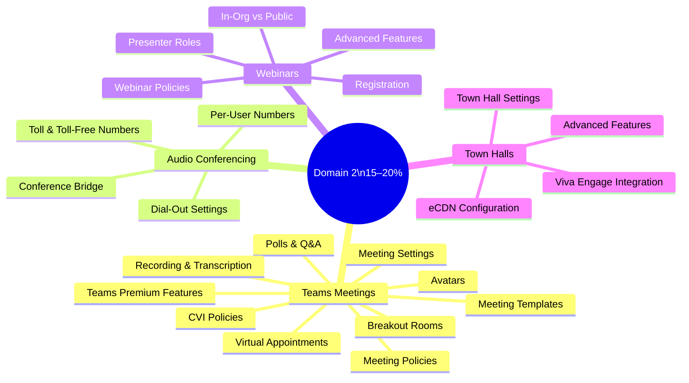

# 02 — Configure & Manage Meetings, Webinars & Town Halls <span class="domain-badge">15–20%</span>
> - Based on: *[MS-721 Study Guide](https://learn.microsoft.com/en-us/credentials/certifications/resources/study-guides/ms-721)*
> - 📁 [← Back to Home](/ms-721-study-notes/)

---

## 🗺 Domain Overview



---

## 🎥 2.1 Configure and Manage Teams Meetings

### Meeting Policies

Meeting policies are assigned to **users** and control what features are available when they organize or participate in meetings:

| Policy Category | Key Settings |
|----------------|-------------|
| **General** | AllowMeetNow, AllowChannelMeetingScheduling, AllowPrivateMeetingScheduling |
| **Recording & transcription** | AllowCloudRecording, AllowTranscription, RecordingStorageMode |
| **Audio & video** | AllowIPVideo, AllowIPAudio, MediaBitRateKb |
| **Content sharing** | AllowScreenContentDigitization, AllowExternalParticipantGiveRequestControl |
| **Participants & guests** | AllowAnonymousUsersToJoinMeeting, AutoAdmittedUsers |
| **Engagement** | AllowMeetingReactions, AllowMeetingChat |

```powershell
# Create a custom meeting policy
New-CsTeamsMeetingPolicy -Identity "ExecutiveMeetings" `
    -AllowCloudRecording $true `
    -AllowTranscription $true `
    -AllowIPVideo $true `
    -AutoAdmittedUsers "EveryoneInCompany"

# Assign to a user
Grant-CsTeamsMeetingPolicy -Identity user@domain.com -PolicyName "ExecutiveMeetings"
```

### Meeting Settings (Tenant-Wide)

Meeting settings apply to **all meetings** in the tenant — they are not per-user:

| Setting | Purpose |
|---------|---------|
| **Anonymous join** | Allow/block anonymous (unauthenticated) users from joining meetings |
| **Meeting invitation customization** | Add logo, legal URL, help URL, footer text to meeting invites |
| **Network settings** | Configure IP ranges for media bypass and QoS |
| **Email communication** | Control whether Teams sends email notifications for meetings |

### Meeting Templates & Template Policies

| Concept | Description |
|---------|-------------|
| **Meeting templates** | Pre-configured meeting settings (who can present, recording, lobby bypass) applied at scheduling time |
| **Custom templates** | Created by admins in Teams Admin Center — enforce specific settings |
| **Template policies** | Control which templates are available to which users |
| **Controlled-content policies** | Restrict what meeting features are available based on template (Teams Premium) |

### Meeting Features

| Feature | Description | License Required |
|---------|-------------|-----------------|
| **Breakout rooms** | Split meeting into smaller groups for discussion | Standard |
| **Polls & forms** | Interactive polls using Microsoft Forms | Standard |
| **Q&A** | Structured question and answer panel | Standard |
| **Meeting apps** | Third-party apps pinned to meeting stage | Standard |
| **Avatars** | 3D avatar representation in meetings | Teams Premium |
| **Custom branding** | Organization logo and colors in lobby/meeting | Teams Premium |
| **Watermarks** | Watermark on video feeds and shared content | Teams Premium |
| **End-to-end encryption** | E2EE for 1:1 and group calls/meetings | Teams Premium |

### Recording & Transcription

| Setting | Details |
|---------|---------|
| **Recording storage** | OneDrive (non-channel meetings) or SharePoint (channel meetings) |
| **Transcription** | Enables real-time captions and post-meeting transcript |
| **Copilot dependency** | Microsoft 365 Copilot in meetings requires transcription to be enabled |
| **Expiration** | Recordings can auto-expire (default: 120 days, configurable) |
| **Recording consent** | Compliance recording can be enforced via policy |

### Virtual Appointments

| Feature | Details |
|---------|---------|
| **Purpose** | Scheduled B2C meetings (healthcare, financial services, retail) |
| **SMS notifications** | Send SMS reminders to external attendees |
| **Waiting room** | Custom branded waiting experience |
| **Advanced policies** | Lobby customization, analytics, queue management (Teams Premium) |

### Cloud Video Interop (CVI) Policies

| Setting | Purpose |
|---------|---------|
| **CVI policy** | Controls whether users' meetings include CVI coordinates for third-party video devices |
| **Providers** | Pexip, Poly, BlueJeans, Cisco (via certified CVI partners) |

> **⚠️ Exam Caveat:**
> - **Meeting policies** apply to the **user** (organizer or participant), not to the meeting itself
> - **Meeting settings** are tenant-wide and cannot be scoped to specific users
> - **Recording storage** moved from Stream (Classic) to **OneDrive/SharePoint** — know where recordings go
> - **Copilot in meetings** requires **both** a Copilot license **and** transcription enabled in meeting policy
> - **Teams Premium** features (watermarks, branding, avatars) require the add-on license even for E5 users

---

## 🎧 2.2 Configure and Manage Audio Conferencing

### Audio Conferencing Bridge

The Audio Conferencing bridge provides dial-in phone numbers for Teams meetings:

| Component | Description |
|-----------|-------------|
| **Shared numbers** | Microsoft-provided toll numbers shared across the tenant |
| **Dedicated numbers** | Toll or toll-free numbers assigned to specific users |
| **Default bridge number** | The number shown on all meeting invitations by default |
| **Bridge settings** | PIN length, entry/exit notifications, meeting join behavior |

### Configuration Steps

| Step | Action |
|------|--------|
| 1 | Assign **Audio Conferencing** license to users |
| 2 | Configure the **default bridge number** (toll) |
| 3 | Add **additional bridge numbers** (toll and toll-free) |
| 4 | Assign **dedicated numbers** to specific users if needed |
| 5 | Configure **toll-free** numbers (requires Communication Credits) |
| 6 | Set **dial-out** policy (who can dial out from meetings) |
| 7 | Customize **meeting invitation** phone numbers per user |

```powershell
# View conference bridge numbers
Get-CsOnlineDialInConferencingBridge

# Assign a dedicated number to a user
Set-CsOnlineDialInConferencingUser -Identity user@domain.com `
    -ServiceNumber "+14255551234"

# Configure toll-free numbers
Set-CsOnlineDialInConferencingUser -Identity user@domain.com `
    -TollFreeServiceNumber "+18005551234"
```

> **⚠️ Exam Caveat:**
> - **Toll-free numbers** on the conference bridge require **Communication Credits** set up and funded
> - Users' **default dial-in number** is based on their **usage location** setting
> - The **conference bridge PIN** is used by organizers to start meetings when they're the first to join via phone
> - **Audio Conferencing** is included in M365 E5 — for E3/E1 it's a separate add-on

---

## 🎤 2.3 Configure and Manage Teams Webinars

### Webinar Configuration

| Setting | Options |
|---------|---------|
| **Who can schedule webinars** | Controlled via meeting policy (AllowMeetingRegistration) |
| **Registration** | Required for attendees — captures name, email, custom questions |
| **In-org vs. public** | In-org webinars limit registration to tenant users; public allows anyone |
| **Presenter roles** | Organizer, co-organizer, presenter (can share, unmute), attendee (view-only) |
| **Engagement reports** | Post-event registration and attendance analytics |

### Webinar Policies

```powershell
# Allow webinar scheduling
Set-CsTeamsMeetingPolicy -Identity "WebinarOrganizers" `
    -AllowMeetingRegistration $true `
    -WhoCanRegister "Everyone"   # or "EveryoneInCompany"

# Grant to users
Grant-CsTeamsMeetingPolicy -Identity user@domain.com -PolicyName "WebinarOrganizers"
```

### Advanced Webinar Features (Teams Premium)

| Feature | Description |
|---------|-------------|
| **Custom registration** | Branded registration page with custom questions |
| **Waitlist** | When webinar is full, attendees join waitlist |
| **Manual approval** | Organizer approves/denies registrations |
| **Reminder emails** | Automated email reminders before the event |
| **Attendee interaction** | Controlled chat, reactions, Q&A for attendees |

> **⚠️ Exam Caveat:**
> - **Webinar** is a meeting type, not a separate product — it's controlled through **meeting policies**
> - **Public webinars** allow external anonymous registration — **in-org** restricts to authenticated tenant users
> - **Advanced webinar features** (waitlist, manual approval, custom branding) require **Teams Premium**

---

## 🏛️ 2.4 Configure and Manage Teams Town Halls

### Town Hall Configuration

| Setting | Details |
|---------|---------|
| **Who can schedule** | Controlled via meeting policy |
| **Capacity** | Up to 10,000 attendees (20,000 with Teams Premium) |
| **Roles** | Organizer, co-organizer, presenter, attendee |
| **Q&A** | Structured Q&A with moderation |
| **Attendee experience** | View-only — no audio/video/screen sharing for attendees |

### Town Hall vs. Webinar vs. Meeting

| Feature | Meeting | Webinar | Town Hall |
|---------|---------|---------|-----------|
| **Interaction** | Full (audio, video, chat) | Presenters + limited attendee | Presenters only; attendees view |
| **Registration** | No | Yes | No |
| **Max capacity** | 1,000 | 1,000 | 10,000–20,000 |
| **Q&A** | Optional | Optional | Built-in |
| **eCDN** | No | No | Yes |
| **Recording** | Yes | Yes | Yes |
| **Breakout rooms** | Yes | No | No |

### eCDN for Town Halls

| Configuration | Details |
|---------------|---------|
| **Microsoft eCDN** | Built-in — enable in Teams Admin Center |
| **Third-party eCDN** | Hive, Kollective, Ramp — requires partner setup |
| **Purpose** | Reduces network bandwidth for large same-site audiences |
| **How it works** | Peer-to-peer content distribution among viewers at the same site |

### Town Halls with Viva Engage and Stream

| Integration | Description |
|-------------|-------------|
| **Viva Engage** | Host town halls within Viva Engage communities — combines social engagement with broadcast |
| **Microsoft Stream** | Town hall recordings are stored in Stream (on SharePoint) for on-demand viewing |

### Advanced Town Hall Features (Teams Premium)

| Feature | Description |
|---------|-------------|
| **Capacity beyond 10,000** | Up to 20,000 attendees |
| **Custom branding** | Organization logo and colors |
| **RTMP-in** | Ingest external video feeds (e.g., production cameras) |
| **VOD (Video on Demand)** | Published recording for on-demand viewing |

> **⚠️ Exam Caveat:**
> - **Town halls** replaced **Live Events** — know the migration path
> - **eCDN** is primarily useful for town halls, not regular meetings or webinars
> - **Attendees in town halls** are view-only — they cannot unmute, share video, or share screen
> - **Viva Engage town halls** combine Yammer-style social engagement with the Teams broadcast experience
> - Town hall **Q&A** is the primary attendee interaction method — it supports moderation

---

## 📝 Quick-Reference Scenarios

| Scenario | Answer |
|----------|--------|
| CEO wants to address 8,000 employees with Q&A | **Town hall** |
| Marketing wants a branded event with registration for 500 external attendees | **Webinar** with **Teams Premium** (custom branding) |
| Need to add dial-in numbers to all meetings | **Audio Conferencing** license + configure conference bridge |
| Toll-free dial-in numbers not working | Verify **Communication Credits** are set up and funded |
| Need to restrict recording in sensitive meetings | Create **meeting policy** with AllowCloudRecording = $false |
| Third-party Cisco video rooms need to join Teams meetings | Configure **Cloud Video Interop (CVI)** policy |
| Meeting recordings expiring too soon | Adjust **recording expiration** setting in meeting policy |
| Copilot not available in meetings for licensed users | Enable **transcription** in meeting policy |
| Need to enforce specific meeting settings for executives | Create **meeting template** with locked settings |
| Large event causing bandwidth issues at office | Enable **Microsoft eCDN** for town halls |

---

[← Previous: 01 — Plan & Design Systems](/ms-721-study-notes/01-plan-design-systems/){: .btn .btn-outline .fs-5 .mr-2 }
[Next → 03 — Teams Phone](/ms-721-study-notes/03-teams-phone/){: .btn .btn-primary .fs-5 }

[🏠 Home](/ms-721-study-notes/){: .btn .btn-outline .fs-3 }
