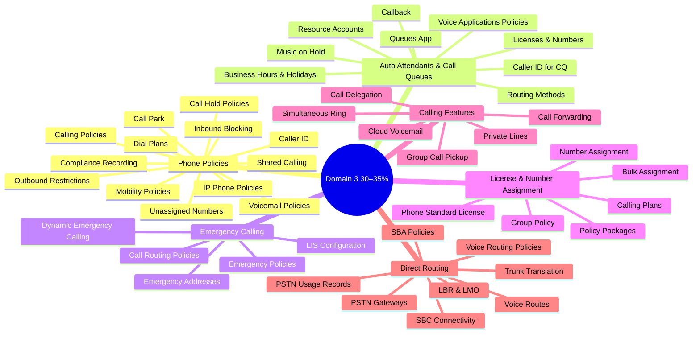
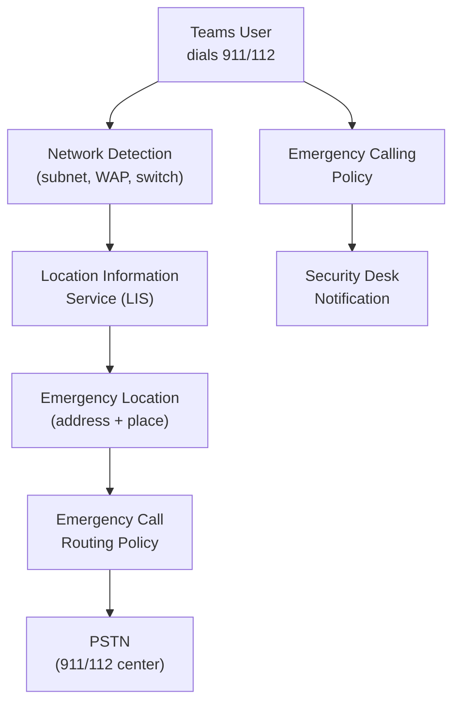
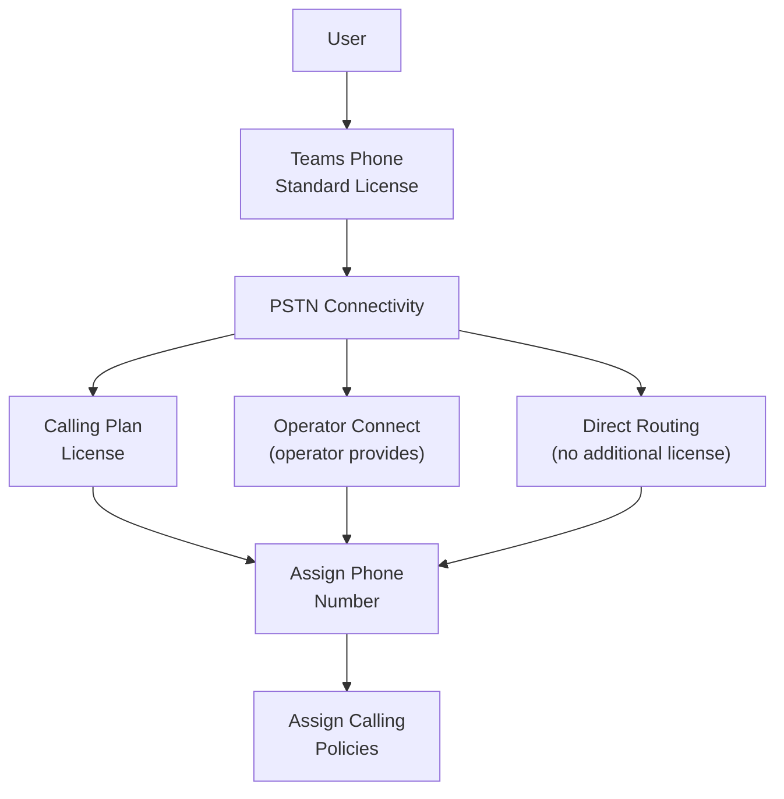
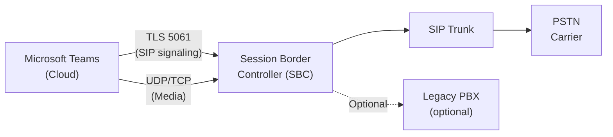
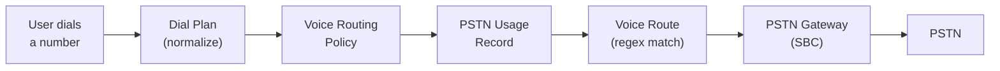

# 03 — Implement & Configure Teams Phone <span class="domain-badge">30–35%</span>
> - Based on: *[MS-721 Study Guide](https://learn.microsoft.com/en-us/credentials/certifications/resources/study-guides/ms-721)*
> - 📁 [← Back to Home](/ms-721-study-notes/)

---

## 🗺 Domain Overview



---

## 📋 3.1 Create and Configure Teams Phone Policies

### Dial Plans

Dial plans **normalize** phone numbers dialed by users into E.164 format:

| Component | Purpose |
|-----------|---------|
| **Normalization rules** | Regex-based rules that convert dialed digits to E.164 (e.g., "91234" → "+441234") |
| **Tenant dial plan** | Custom dial plan created by admin — appended to service (country) dial plan |
| **Service dial plan** | Microsoft-provided country-specific dial plan (auto-assigned based on usage location) |
| **Effective dial plan** | Combination of service + tenant dial plan — tenant rules are evaluated first |

```powershell
# Create a tenant dial plan
New-CsTenantDialPlan -Identity "UK-DialPlan"

# Add a normalization rule
$rule = New-CsVoiceNormalizationRule -Identity "UK-DialPlan/4DigitExtension" `
    -Pattern '^(\d{4})$' `
    -Translation '+4420$1' `
    -IsInternalExtension $true

Set-CsTenantDialPlan -Identity "UK-DialPlan" -NormalizationRules @{Add=$rule}

# Assign to user
Grant-CsTenantDialPlan -Identity user@domain.com -PolicyName "UK-DialPlan"
```

> **⚠️ Exam Caveat:**
> - Tenant dial plan rules are evaluated **before** service dial plan rules
> - **E.164 format** is always `+[country code][number]` — e.g., `+14255551234`
> - Dial plans do NOT route calls — they only **normalize** the dialed number; voice routing policies handle routing

### Calling Policies

| Setting | Purpose |
|---------|---------|
| **AllowPrivateCalling** | Enable/disable 1:1 PSTN and VoIP calls |
| **AllowCallForwardingToUser** | Allow forwarding to another Teams user |
| **AllowCallForwardingToPhone** | Allow forwarding to PSTN number |
| **AllowVoicemail** | Control voicemail behavior (AlwaysEnabled, AlwaysDisabled, UserOverride) |
| **AllowCallGroups** | Enable call group pickup |
| **AllowDelegation** | Enable call delegation (boss/admin) |
| **AllowWebPSTNCalling** | Allow PSTN calling from Teams web client |
| **PreventTollBypass** | Block toll bypass for Location-Based Routing |
| **BusyOnBusyEnabledType** | What happens when user is already on a call (busy signal, voicemail, etc.) |

### Call Park Policies

Call Park lets users **put a call on hold** and retrieve it from any Teams device using a code:

| Setting | Purpose |
|---------|---------|
| **AllowCallPark** | Enable/disable call park for users |
| **CallPickupInOrder** | Who can retrieve a parked call |
| **ParkTimeoutSeconds** | How long before a parked call rings back (default: 300 seconds) |

### Caller ID Policies

| Setting | Purpose |
|---------|---------|
| **CallingIDSubstitute** | What caller ID is shown: LineUri (user's number), Anonymous, Service number, Resource account |
| **EnableUserOverride** | Whether users can change their own caller ID |
| **BlockIncomingCallerID** | Block caller ID for incoming calls |
| **CompanyName** | Display company name instead of number for outbound PSTN calls |

### Voicemail Policies

| Setting | Purpose |
|---------|---------|
| **EnableTranscription** | Voicemail-to-text transcription |
| **EnableTranscriptionProfanityMasking** | Mask profanity in transcripts |
| **MaximumRecordingLength** | Maximum voicemail duration (default: 300 seconds) |
| **EnableEditingCallAnswerRulesSetting** | Allow users to configure call answer rules |
| **PrimarySystemPromptLanguage** | Language for system prompts |
| **ShareData** | Share voicemail and transcription data for service improvement |

### Other Phone Policies

| Policy | Purpose |
|--------|---------|
| **IP Phone policies** | Control sign-in mode (UserSignIn, CommonAreaPhoneSignIn), hot desking |
| **Mobility policies** | Control IP video and WiFi calling on mobile devices |
| **Call hold policies** | Configure custom Music on Hold (audio file) |
| **Outbound call restrictions** | Control who can make international/premium calls |
| **Inbound call blocking** | Block calls from specific number patterns |
| **Unassigned number routing** | Route calls to unassigned numbers (announcement, auto attendant, user) |
| **Compliance recording** | Record calls for regulatory compliance via certified partner solutions |
| **Shared Calling policies** | Define shared phone number behavior for frontline workers |

> **⚠️ Exam Caveat:**
> - **Dial plans normalize**, **voice routing policies route** — these are two separate steps
> - **Caller ID policies** can show the user's number, a service number, a resource account number, or anonymous
> - **Compliance recording** requires a **certified third-party solution** — it cannot be done natively in Teams
> - **BusyOnBusy** setting controls whether a second incoming call goes to voicemail, gets a busy signal, or is presented to the user

---

## 📞 3.2 Create and Configure Auto Attendants and Call Queues

### Resource Accounts

Every auto attendant and call queue needs a **resource account**:

| Step | Action |
|------|--------|
| 1 | Create a resource account (application instance) in Teams Admin Center or PowerShell |
| 2 | Assign a **Teams Phone Resource Account** license (free) |
| 3 | Assign a **phone number** if the AA/CQ needs to be reachable from PSTN |
| 4 | Associate the resource account with the auto attendant or call queue |

```powershell
# Create resource account for auto attendant
New-CsOnlineApplicationInstance `
    -UserPrincipalName mainline-aa@domain.com `
    -DisplayName "Main Line Auto Attendant" `
    -ApplicationId "ce933385-9390-45d1-9512-c8d228074e07"

# Create resource account for call queue
New-CsOnlineApplicationInstance `
    -UserPrincipalName sales-cq@domain.com `
    -DisplayName "Sales Call Queue" `
    -ApplicationId "11cd3e2e-fccb-42ad-ad00-878b93575e07"
```

### Call Queue Routing Methods

| Method | Behavior |
|--------|----------|
| **Attendant routing** | All agents ring simultaneously |
| **Serial routing** | Agents ring one at a time in a fixed order |
| **Round robin** | Agents ring one at a time in rotating order |
| **Longest idle** | Agent who has been idle longest rings first |

### Call Queue Features

| Feature | Description |
|---------|-------------|
| **Overflow** | What happens when queue is full (voicemail, redirect, disconnect) |
| **Timeout** | What happens when no agent answers within time limit |
| **Callback** | Callers can request a callback instead of waiting in queue |
| **Call priorities** | Priority routing across multiple call queues |
| **Music on Hold** | Default or custom audio file played while waiting |
| **Conference mode** | Reduces connect time when agent answers (pre-establishes connection) |
| **Opt-in/out** | Agents can opt in/out of receiving queue calls |

### Auto Attendant Configuration

| Component | Details |
|-----------|---------|
| **Business hours greeting** | Custom audio or text-to-speech greeting during business hours |
| **After hours greeting** | Greeting played outside business hours |
| **Holiday greeting** | Greeting for configured holiday dates |
| **Menu options** | DTMF (dial pad) options routing to users, call queues, other AAs, external numbers |
| **Dial by name** | Directory search by voice or DTMF |
| **Operator** | Designated person or group for "press 0" routing |

### Voice Applications Policies

Control who can manage auto attendants and call queues without being a full Teams admin:

| Setting | Purpose |
|---------|---------|
| **Auto attendant management** | Allow specific users to create/edit auto attendants |
| **Call queue management** | Allow specific users to create/edit call queues |
| **Authorized users** | Define who can manage specific AAs/CQs |

### Queues App

| Feature | Description |
|---------|-------------|
| **Purpose** | Teams app for agents and supervisors to manage call queue interactions |
| **Agent view** | See queue status, answer/transfer calls, opt in/out |
| **Supervisor view** | Monitor agents, view real-time queue statistics |
| **Configuration** | Enabled via voice applications policy |

> **⚠️ Exam Caveat:**
> - **Resource accounts** need a **Teams Phone Resource Account** license (free) — but need a **Calling Plan** or **Virtual User** license for a phone number
> - **Toll-free numbers** on resource accounts require **Communication Credits**
> - **Callback** in call queues lets callers hang up and get called back when an agent is available
> - Auto attendants support **nested routing** — AA → AA → CQ is a valid configuration
> - **Conference mode** in call queues should be enabled for faster call connection (reduces ring time)

---

## 🚨 3.3 Configure Emergency Calling

### Emergency Calling Components



### Emergency Address Configuration

| Component | Description |
|-----------|-------------|
| **Emergency address** | Civic address (street, city, state, country) — must be validated |
| **Place** | Location within an address (floor, wing, building) |
| **Validated address** | Address confirmed with PSTN provider (required for Calling Plans) |

### Location Information Service (LIS)

LIS maps network elements to emergency locations:

| Network Element | Example |
|----------------|---------|
| **Subnet** | 10.10.10.0/24 → "Building A, Floor 3" |
| **Wireless Access Point (WAP)** | BSSID → "Building B, Floor 1" |
| **Ethernet switch** | Chassis ID → "Building C, Floor 2" |
| **Switch port** | Specific port → "Building C, Floor 2, Room 201" |

### Emergency Calling Policy

| Setting | Purpose |
|---------|---------|
| **Notification mode** | How security desk is notified (Teams chat, conference in, etc.) |
| **Notification group** | Who receives emergency call notifications |
| **External location lookup mode** | Whether to use external location services |
| **Emergency numbers** | Configure emergency dialing strings (e.g., 911, 112, 999) |

### Emergency Call Routing Policy (Direct Routing)

| Setting | Purpose |
|---------|---------|
| **Emergency dialing string** | Number pattern that triggers emergency routing (e.g., 911) |
| **Emergency dial mask** | Alternative patterns that map to the emergency string (e.g., 933) |
| **PSTN usage** | Which PSTN usage record (and therefore which SBC/gateway) routes the emergency call |

> **⚠️ Exam Caveat:**
> - **Dynamic emergency calling** requires LIS to be configured with network data (subnets, WAPs, switches)
> - For **Calling Plans**, emergency addresses must be **validated** — Direct Routing addresses are not validated by Microsoft
> - **Security desk notification** is configured in the emergency calling policy, not the routing policy
> - **Emergency call routing policies** are only needed for **Direct Routing** — Calling Plans and Operator Connect handle routing automatically
> - The **emergency dial mask** (e.g., 933) can be used for testing without actually calling emergency services

---

## 🔢 3.4 Assign Teams Phone Licenses, Numbers, and Policies

### License Assignment Flow



### Phone Number Assignment

| Method | Tool | Best For |
|--------|------|---------|
| **Individual** | Teams Admin Center | One-off assignments |
| **Bulk (PowerShell)** | `Set-CsPhoneNumberAssignment` | Large-scale deployments |
| **CSV import** | Teams Admin Center | Medium-scale batch |

```powershell
# Assign a phone number (Calling Plan)
Set-CsPhoneNumberAssignment -Identity user@domain.com `
    -PhoneNumber "+14255551234" `
    -PhoneNumberType CallingPlan

# Assign a phone number (Direct Routing)
Set-CsPhoneNumberAssignment -Identity user@domain.com `
    -PhoneNumber "+14255551234" `
    -PhoneNumberType DirectRouting

# Bulk assignment via CSV
Import-Csv "users.csv" | ForEach-Object {
    Set-CsPhoneNumberAssignment -Identity $_.UserPrincipalName `
        -PhoneNumber $_.PhoneNumber `
        -PhoneNumberType $_.NumberType
}
```

### Policy Assignment Methods

| Method | Scope | Tool |
|--------|-------|------|
| **Direct** | Individual user | TAC or PowerShell |
| **Group** | Security group or M365 group | TAC or PowerShell |
| **Batch** | CSV of users | PowerShell |
| **Policy package** | Role-based bundle | TAC or PowerShell |
| **Global (default)** | All users without explicit assignment | TAC or PowerShell |

> **⚠️ Exam Caveat:**
> - **PhoneNumberType** must match the connectivity method: `CallingPlan`, `DirectRouting`, or `OperatorConnect`
> - Bulk phone number assignment via PowerShell uses `Set-CsPhoneNumberAssignment`, not the deprecated `Set-CsUser`
> - **Policy precedence**: Direct > Group > Global default
> - **Policy packages** assign multiple policy types at once (calling, meeting, messaging) — useful for role-based deployment

---

## 🔧 3.5 Configure and Manage Calling Features

### Cloud Voicemail

| Feature | Details |
|---------|---------|
| **Storage** | Exchange Online mailbox |
| **Transcription** | Automatic speech-to-text (configurable via voicemail policy) |
| **Greeting** | Custom recorded or text-to-speech |
| **Call answer rules** | Configure in Teams client — forward to voicemail, custom greeting per caller |
| **Deposit only** | Voicemail receives messages but user cannot configure settings (useful for shared mailboxes) |

### Call Forwarding & Simultaneous Ring

| Feature | Description |
|---------|-------------|
| **Call forwarding** | Route incoming calls to another user, phone number, or voicemail |
| **Simultaneous ring** | Ring multiple endpoints at the same time (Teams + mobile, etc.) |
| **Unanswered timeout** | If not answered within X seconds, forward to next destination |
| **Controlled by** | Calling policy (admin can allow/restrict) + user configuration |

### Call Delegation

| Concept | Description |
|---------|-------------|
| **Delegate** | An assistant who can make/receive calls on behalf of another user |
| **Delegator** | The boss/executive whose calls are managed |
| **Permissions** | Make calls, receive calls, change settings on behalf of delegator |
| **Configuration** | User configures in Teams client; admin enables via calling policy |

### Group Call Pickup

| Feature | Details |
|---------|---------|
| **Purpose** | Allow a group of users to answer each other's calls |
| **Configuration** | User creates a call group in Teams settings |
| **Ring order** | All at once or in order |
| **Enabled by** | `AllowCallGroups` in calling policy |

### Audio Conferencing (for Phone Users)

| Feature | Details |
|---------|---------|
| **Dial-in** | Users join meetings by dialing a conference bridge number |
| **Dial-out** | Meeting calls out to a PSTN number to add a participant |
| **Operator** | Auto attendant integration for conference bridge |

### Private Lines

| Feature | Details |
|---------|---------|
| **Purpose** | A second phone number for a user that bypasses delegates and call forwarding |
| **Use case** | Executive wants a direct line that skips the assistant |
| **Configuration** | PowerShell only — assign via `Set-CsPhoneNumberAssignment` with `-PhoneNumber` for the private line |

> **⚠️ Exam Caveat:**
> - **Cloud Voicemail** is stored in **Exchange Online** — user needs an Exchange mailbox
> - **Call delegation** must be enabled in the **calling policy** AND configured by the user in Teams client
> - **Private lines** bypass call forwarding, delegates, and simultaneous ring — calls go directly to the user
> - **Group call pickup** and **call delegation** are different features — pickup is peer-based, delegation is boss/admin

---

## 🌐 3.6 Configure and Manage Direct Routing

### Direct Routing Architecture



### SBC Configuration

```powershell
# Create PSTN gateway (SBC)
New-CsOnlinePSTNGateway -Fqdn "sbc01.domain.com" `
    -SipSignalingPort 5061 `
    -Enabled $true `
    -MaxConcurrentSessions 100 `
    -MediaBypass $true `
    -GatewaySiteId "LondonSite"

# Verify SBC connectivity
Get-CsOnlinePSTNGateway -Identity "sbc01.domain.com"
```

### Voice Routing Configuration

The voice routing chain in Direct Routing:



| Component | Purpose |
|-----------|---------|
| **PSTN Usage Record** | Links voice routing policies to voice routes |
| **Voice Route** | Matches dialed number pattern (regex) and routes to specific SBC(s) |
| **Voice Routing Policy** | Assigned to users — determines which PSTN usage records are available |
| **PSTN Gateway** | The SBC definition in Teams (FQDN, port, settings) |

```powershell
# Create PSTN usage record
Set-CsOnlinePstnUsage -Usage @{Add="US-Domestic"}

# Create voice route
New-CsOnlineVoiceRoute -Identity "US-Domestic-Route" `
    -NumberPattern "^\+1(\d{10})$" `
    -OnlinePstnGatewayList "sbc01.domain.com" `
    -OnlinePstnUsages "US-Domestic" `
    -Priority 1

# Create voice routing policy
New-CsOnlineVoiceRoutingPolicy -Identity "US-VoicePolicy" `
    -OnlinePstnUsages "US-Domestic"

# Assign to user
Grant-CsOnlineVoiceRoutingPolicy -Identity user@domain.com -PolicyName "US-VoicePolicy"
```

### SBC Requirements

| Requirement | Details |
|-------------|---------|
| **Public IP** | SBC must have a public IP (or NAT) reachable from Microsoft |
| **TLS certificate** | Trusted CA certificate with SBC FQDN in CN or SAN |
| **SIP signaling** | TLS port 5061 |
| **Media ports** | UDP — configurable range (typically 49152–53247) |
| **DNS** | Public DNS A record pointing to SBC public IP |
| **Certification** | Must be on the [Microsoft certified SBC list](https://learn.microsoft.com/en-us/MicrosoftTeams/direct-routing-border-controllers) |

### Advanced Direct Routing Features

| Feature | Purpose |
|---------|---------|
| **Location-Based Routing (LBR)** | Prevents toll bypass — routes calls based on user's physical location |
| **Local Media Optimization (LMO)** | Keeps media traffic local within branch offices |
| **Media bypass** | Routes media directly between user and SBC, bypassing Microsoft cloud |
| **Trunk translation rules** | Manipulate SIP headers (called/calling number) between Teams and SBC |
| **On-network conferencing** | PSTN participants in Direct Routing conferences connect via local SBC |
| **Survivable Branch Appliance (SBA)** | Maintains calling during internet outages at branch offices |

### Trunk Translation Rules

| Rule | Purpose |
|------|---------|
| **CalledNumberTranslationRule** | Modify the called (destination) number sent to the SBC |
| **CallingNumberTranslationRule** | Modify the calling (source) number sent to the SBC |
| **Use case** | Strip/add country code, convert between E.164 and local format |

```powershell
# Create a trunk translation rule
New-CsOnlinePSTNGateway -Fqdn "sbc01.domain.com" `
    -OutboundCallingNumberTranslationRulesList @{Add="StripPlusRule"} `
    -OutboundCalledNumberTranslationRulesList @{Add="AddCountryCode"}
```

### Troubleshooting Direct Routing

| Tool | Purpose |
|------|---------|
| **SBC Health Dashboard** | Teams Admin Center → Voice → SBCs → health status |
| **Call Analytics** | Per-user call details and diagnostics |
| **CQD** | Tenant-wide call quality metrics |
| **SBC logs** | Vendor-specific SBC logging and diagnostics |
| **Teams Admin Center diagnostics** | Built-in connectivity test for SBC |

> **⚠️ Exam Caveat:**
> - Voice routing chain: **Dial Plan** (normalize) → **Voice Routing Policy** (user) → **PSTN Usage** → **Voice Route** (pattern match) → **SBC**
> - **Media bypass** and **LMO** reduce latency and bandwidth but have specific network requirements
> - **LBR** is for regulatory compliance — prevents users from making PSTN calls that would bypass local toll charges
> - SBC certificates must be from a **trusted public CA** — self-signed certificates are not supported
> - **SBA policies** define which SBAs are available at which sites for failover during internet outages

---

## 📝 Quick-Reference Scenarios

| Scenario | Answer |
|----------|--------|
| Users dial 4-digit extensions to reach internal colleagues | **Tenant dial plan** with normalization rules |
| Outbound calls must show company main number, not user's number | **Caller ID policy** with CallingIDSubstitute = Service number |
| Need to record all calls for regulatory compliance | **Compliance recording policy** with certified partner solution |
| Auto attendant needs to be reachable from PSTN | Resource account needs **phone number** + Virtual User or Calling Plan license |
| Call queue agents need to opt in/out of receiving calls | Enable **opt-in/out** in call queue settings |
| Emergency calls must route based on office location | **Dynamic emergency calling** with LIS (subnets, WAPs) |
| Branch office needs calling during internet outage | **Survivable Branch Appliance (SBA)** |
| Direct Routing SBC not connecting | Verify TLS certificate, DNS, port 5061, and certified SBC status |
| PSTN calls need to route to different SBCs based on destination | **Voice routes** with number pattern matching + multiple SBCs |
| Users should not be able to make international calls | **Outbound call restrictions** policy or voice routing policy limiting routes |

---

[← Previous: 02 — Meetings, Webinars & Town Halls](/ms-721-study-notes/02-meetings-webinars-townhalls/){: .btn .btn-outline .fs-5 .mr-2 }
[Next → 04 — Teams Rooms & Devices](/ms-721-study-notes/04-teams-rooms-devices/){: .btn .btn-primary .fs-5 }

[🏠 Home](/ms-721-study-notes/){: .btn .btn-outline .fs-3 }
