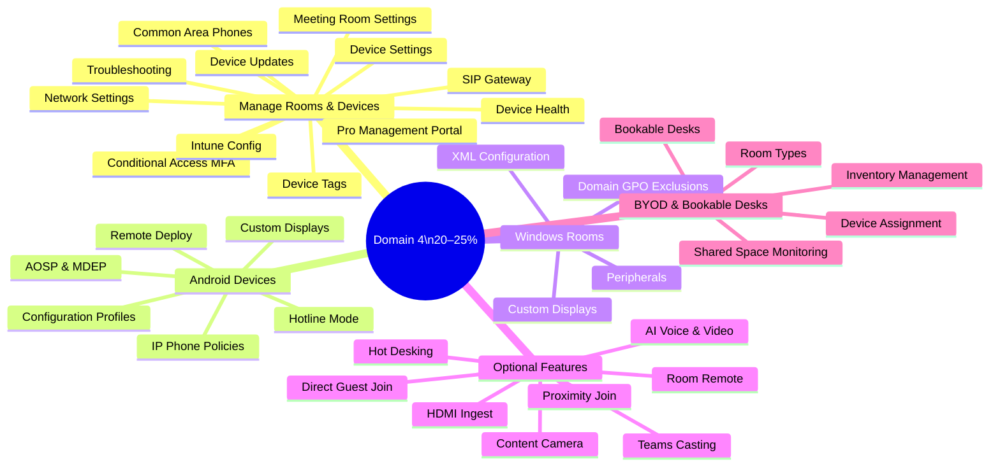

# 04 — Configure & Manage Teams Rooms & Devices 20–25%
> - Based on: *[MS-721 Study Guide](https://learn.microsoft.com/en-us/credentials/certifications/resources/study-guides/ms-721)*
> - 📁 [← Back to Home](/ms-721-study-notes/)

---

## 🗺 Domain Overview

---

## 🖥️ 4.1 Manage and Maintain Teams Rooms and Devices

### Device Management in Teams Admin Center

| Section | Purpose |
|---------|---------|
| **Teams devices** | View all registered Teams devices, health status, software versions |
| **Configuration profiles** | Push settings to groups of devices |
| **Device tags** | Organize devices with custom labels for bulk management |
| **Device updates** | Manage firmware and Teams app updates |

### Device Settings

| Setting | Description |
|---------|-------------|
| **Device account** | Resource account signed into the device |
| **Network settings** | Proxy, VLAN, 802.1X configuration on the device |
| **Display settings** | Resolution, scale, dual display configuration |
| **Time zone** | Local time zone for the device |
| **Language** | UI language |

### Device Update Management

| Update Type | Description |
|-------------|-------------|
| **Auto-update** | Devices update automatically on Microsoft's schedule |
| **Manual update** | Admin triggers update from Teams Admin Center |
| **Update phases** | Validation → General availability (staged rollout) |
| **Firmware** | OEM-provided firmware updates for specific hardware |
| **Teams app** | Teams client update on the device |

### Conditional Access for Room Accounts

Room resource accounts may need **MFA exclusions** because:
- Teams Rooms devices sign in non-interactively
- MFA prompts cannot be completed on room devices
- Use **Conditional Access exclusion** for room accounts while maintaining security via:
  - Trusted location (IP-based)
  - Compliant device requirement (via Intune)
  - Certificate-based authentication

> **⚠️ Exam Caveat:**
> - Do NOT exclude room accounts from ALL Conditional Access — use **targeted exclusions** with compensating controls
> - Recommended approach: exclude from MFA policy but require **compliant device** or **trusted location**
> - Room accounts should have **password set to never expire** in Entra ID

### Teams Rooms Pro Management Portal

| Feature | Details |
|---------|---------|
| **URL** | portal.rooms.microsoft.com |
| **License required** | Teams Rooms Pro |
| **Monitoring** | Real-time device health, peripheral status, network quality |
| **Alerts** | Automatic alerts for offline devices, peripheral failures, update issues |
| **Incidents** | Track and manage device issues |
| **Remote actions** | Restart device, collect logs, push configuration |
| **Analytics** | Usage reports, meeting quality, room utilization |

### Common Area Phones, User Phones, and Conference Phones

| Device Type | License | Use Case |
|-------------|---------|----------|
| **Common area phone** | Common Area Phone license | Shared spaces — lobby, break room, factory floor |
| **User phone** | Teams Phone Standard (user license) | Personal desk phone for individual user |
| **Conference phone** | Teams Rooms Basic/Pro | Conference room speakerphone |

### SIP Gateway and SIP Devices

| Component | Purpose |
|-----------|---------|
| **SIP Gateway** | Enables compatible SIP phones to register with Teams |
| **SIP devices** | Third-party SIP phones (Cisco, Poly, Yealink) that work with Teams via SIP Gateway |
| **Provisioning** | SIP devices are provisioned via the Teams Admin Center |
| **Features** | Basic calling, voicemail, call transfer — limited compared to native Teams phones |

### Device Tags

| Feature | Purpose |
|---------|---------|
| **Custom tags** | Label devices by location, department, type, etc. |
| **Bulk operations** | Apply updates or configurations to tagged groups |
| **Filtering** | Filter device list by tags in Teams Admin Center |

### Troubleshooting Devices

| Issue | Approach |
|-------|----------|
| **Authentication failures** | Check resource account password, Conditional Access policies, license assignment |
| **Update failures** | Verify network connectivity, check for pending firmware prerequisites |
| **Remote provisioning issues** | Verify device is online, check provisioning profile, network access |
| **Proximity join issues** | Verify Bluetooth is enabled, Teams app is up to date, same network segment |
| **Peripheral failures** | Check USB connections, firmware versions, certified peripheral list |

> **⚠️ Exam Caveat:**
> - **SIP Gateway** provides basic Teams calling to SIP phones — these phones do NOT get the full Teams experience
> - **Device tags** are used for organization and bulk management — they don't affect policies
> - **Teams Rooms Pro Management portal** requires a Pro license — Basic license devices are managed only from Teams Admin Center

---

## 📱 4.2 Configure and Manage Teams Android Devices

### IP Phone Policies

| Setting | Purpose |
|---------|---------|
| **SignInMode** | UserSignIn (personal), CommonAreaPhoneSignIn (shared), MeetingSignIn (room) |
| **SearchOnCommonAreaPhoneMode** | Enable/disable search on common area phones |
| **AllowHotDesking** | Enable hot desking on shared devices |
| **HotDeskingIdleTimeoutInMinutes** | Auto sign-out timeout for hot desking |

### Device Configuration Profiles

Configuration profiles push settings to Android devices in bulk:

| Category | Settings |
|----------|----------|
| **General** | Device lock, time zone, language, screen timeout |
| **Display** | Brightness, screensaver, theme |
| **Network** | Wi-Fi, proxy, DNS |
| **Device features** | Bluetooth, NFC, USB |

### Hotline Mode

| Feature | Details |
|---------|---------|
| **Purpose** | Shared device automatically calls a specific number when handset is lifted |
| **Use case** | Emergency phones, information desks, factory floor |
| **Configuration** | Set target number and delay before auto-dial |

### Remote Deployment of Android Devices

| Method | Description |
|--------|-------------|
| **Remote provisioning** | Provision devices remotely via MAC address or serial number |
| **Zero-touch enrollment** | Device automatically connects and configures on first boot |
| **QR code** | Scan QR code for initial setup |

### Custom Displays

| Device | Customization |
|--------|--------------|
| **Teams Rooms on Android** | Custom background images, logo on home screen |
| **Teams panels** | Room-specific information, custom branding |

### AOSP and MDEP Device Management

| Platform | Description |
|----------|-------------|
| **AOSP** (Android Open Source Project) | Android-based management for Teams devices without Google Play services |
| **MDEP** (Microsoft Device Ecosystem Platform) | Microsoft's device management framework for Teams devices |
| **Intune enrollment** | Enroll AOSP devices in Intune for compliance and configuration |

> **⚠️ Exam Caveat:**
> - **AOSP** is the management platform for Teams Android devices — it's NOT standard Android Enterprise
> - **Hotline mode** is different from hot desking — hotline auto-dials a number, hot desking allows temporary user sign-in
> - **IP Phone policies** control sign-in mode — this determines if the device is personal, shared, or a meeting room
> - **Teams Rooms Pro** license is required for Intune enrollment of Teams Rooms devices

---

## 🪟 4.3 Configure and Manage Teams Rooms on Windows

### Domain Group Policy Exclusions

Teams Rooms on Windows should be **excluded** from certain GPO settings that can break the device:

| Exclusion | Reason |
|-----------|--------|
| **Screen lock timeout** | Room should not lock during meetings |
| **Windows Update policies** | Teams Rooms has its own update mechanism |
| **Power management** | Device should not sleep/hibernate |
| **Security policies** | Some policies can block auto-sign-in |
| **User profile policies** | Room account uses a local profile |

### XML Configuration File

Teams Rooms on Windows can be configured via an XML file (`SkypeSettings.xml`):

| Setting | Purpose |
|---------|---------|
| **ThemeName** | Custom theme (background/colors) |
| **DefaultVolume** | Default speaker volume |
| **AutoScreenShare** | Automatically share content when HDMI detected |
| **BluetoothAdvertisementEnabled** | Enable/disable Bluetooth for proximity join |
| **TeamsMeetingsEnabled** | Enable Teams meeting join capability |
| **SfBMeetingsEnabled** | Enable Skype for Business meeting join (legacy) |
| **DualScreenMode** | Enable dual display mode |
| **SendLogs** | Enable remote log collection |

### Custom Displays for Windows Rooms

| Feature | Details |
|---------|---------|
| **Custom backgrounds** | Set room-specific background images |
| **Front-of-room display** | Configure layout for single or dual displays |
| **Touch console** | Room control panel configuration |
| **Content layout** | Side-by-side, full screen, gallery view defaults |

### Peripheral Configuration

| Peripheral | Configuration |
|------------|--------------|
| **Camera** | Default camera, pan/tilt/zoom settings |
| **Microphone** | Default mic, noise suppression |
| **Speaker** | Default speaker, volume |
| **Content camera** | Whiteboard camera with AI enhancement |
| **HDMI ingest** | External video source input |

> **⚠️ Exam Caveat:**
> - **SkypeSettings.xml** is the primary configuration file for Teams Rooms on Windows — it's placed in a specific directory on the device
> - **GPO exclusions** are critical — applying standard domain policies to Teams Rooms can break auto-sign-in and meeting join
> - Teams Rooms on Windows runs a **dedicated Windows IoT Enterprise** OS — do not treat it as a standard Windows PC
> - **Dual display mode** requires hardware support and is configured in both XML and device settings

---

## ⚙️ 4.4 Configure Optional Features for Teams Rooms and Devices

### Feature Configuration

| Feature | Purpose | Configuration |
|---------|---------|---------------|
| **HDMI ingest** | Bring external video sources into Teams meetings | Enable in room settings; configure HDMI input |
| **Content camera** | AI-enhanced whiteboard capture | Configure camera position; enable intelligent capture |
| **Teams casting** | Cast content from personal device to room display | Enable Bluetooth/proximity discovery |
| **Proximity join** | Auto-detect nearby room and join meeting | Requires Bluetooth enabled on both room and user device |
| **Room remote** | Control room from personal Teams app | Proximity-based; requires same network |
| **Direct Guest Join** | Join Cisco Webex or Zoom meetings from Teams Rooms | Enable in admin center; supported platforms only |
| **Hot desking** | Temporary user sign-in on shared devices | Enable in IP phone policy; configure timeout |
| **AI voice/video** | Intelligent speaker recognition, noise suppression | Enable in room settings; requires supported hardware |

### Content Camera

| Feature | Details |
|---------|---------|
| **Intelligent capture** | AI crops and enhances whiteboard content |
| **Background removal** | Removes presenter from whiteboard view |
| **Requirements** | Supported camera (e.g., Logitech Scribe), Teams Rooms on Windows |

### Proximity Join & Teams Casting

| Feature | How It Works |
|---------|-------------|
| **Proximity join** | User's Teams client detects nearby room via Bluetooth → offers "Join on this device" |
| **Teams casting** | User casts content from their laptop to the room display — no meeting join required |
| **Requirements** | Bluetooth enabled on room device and user device, same network recommended |

> **⚠️ Exam Caveat:**
> - **Content camera** only works on **Teams Rooms on Windows**, not Android
> - **Direct Guest Join** for Webex/Zoom is a specific feature that must be enabled — it's not available by default
> - **Proximity join** requires **Bluetooth** — it does NOT work over Wi-Fi alone
> - **Hot desking** on shared devices uses the **IP Phone policy**, not a separate hot desking policy

---

## 🏢 4.5 Configure BYOD Spaces and Bookable Desks

### Room Types

| Concept | Description |
|---------|-------------|
| **Room types** | Templates defining what a space includes (display, peripherals, furniture) |
| **Publishing** | Published room types become available for room inventory |
| **Custom types** | Create types matching your organization's room standards |

### Inventory Management

| Feature | Description |
|---------|-------------|
| **Discovery** | Auto-discover devices on the network |
| **Import** | Bulk import hardware via CSV |
| **Assignment** | Assign discovered devices to room types |
| **Tracking** | Monitor device health and inventory status |

### Bookable Desks (Microsoft Places)

| Feature | Details |
|---------|---------|
| **Purpose** | Enable desk booking for hybrid workers |
| **Setup** | Configure buildings and floors in Microsoft Places |
| **Desk pools** | Group desks by location, floor, or area |
| **Booking** | Users book desks via Teams or Outlook |
| **Configuration** | Set availability, booking rules, and restrictions |

### BYOD Spaces

| Feature | Details |
|---------|---------|
| **Concept** | Meeting rooms where users bring their own devices (laptops) |
| **Hardware** | Display, USB peripherals (camera, speaker) — no dedicated compute |
| **Booking** | Room can be booked via Exchange room mailbox |
| **Experience** | User connects their laptop to room peripherals via USB/HDMI |

### Monitoring Shared Spaces

| Monitoring | Tool |
|-----------|------|
| **Room health** | Teams Rooms Pro Management portal |
| **Device status** | Teams Admin Center → Devices |
| **Usage reports** | Teams Admin Center → Analytics & Reports |
| **Desk utilization** | Microsoft Places analytics |

> **⚠️ Exam Caveat:**
> - **BYOD rooms** don't need a resource account with Teams Rooms license — they're just a room mailbox + peripherals
> - **Bookable desks** are managed through **Microsoft Places**, not the Teams Admin Center
> - **Room types** help standardize room configurations across the organization
> - **Inventory management** supports both auto-discovery and manual CSV import

---

## 📝 Quick-Reference Scenarios

| Scenario | Answer |
|----------|--------|
| Small huddle room (4 people) needs Teams video calling on a budget | **Teams Rooms on Android** with **Teams Rooms Basic** license |
| Large boardroom needs dual displays, content camera, and advanced analytics | **Teams Rooms on Windows** with **Teams Rooms Pro** license |
| Room account keeps getting locked by MFA Conditional Access | **Exclude room account** from MFA policy; add compliant device or trusted location requirement |
| Lobby phone needs to auto-dial reception when picked up | **Hotline mode** on common area phone |
| SIP phones from existing PBX need to work with Teams | **SIP Gateway** provisioning |
| Teams Rooms on Windows not updating properly | Check **GPO exclusions** — standard Windows Update policies may conflict |
| Users need to book desks in hybrid office | **Microsoft Places** with bookable desk configuration |
| Meeting room has third-party Cisco video system | **Cloud Video Interop (CVI)** or **Direct Guest Join** |
| Need to manage 200 Teams Rooms remotely | **Teams Rooms Pro** license + **Pro Management portal** |
| Conference room whiteboard needs to be shared in Teams meeting | **Content camera** with intelligent capture (Windows only) |

---

[← Previous: 03 — Teams Phone](/ms-721-study-notes/03-teams-phone/){: .btn .btn-outline .fs-5 .mr-2 }
[Next → 05 — Quick Reference Cheatsheet](/ms-721-study-notes/05-quick-reference-cheatsheet/){: .btn .btn-primary .fs-5 }

[🏠 Home](/ms-721-study-notes/){: .btn .btn-outline .fs-3 }
