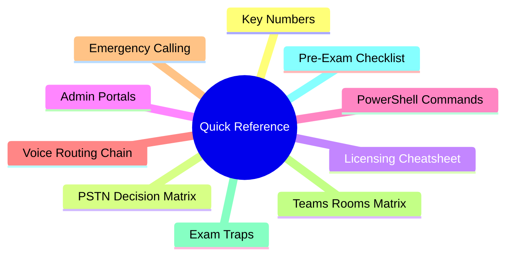
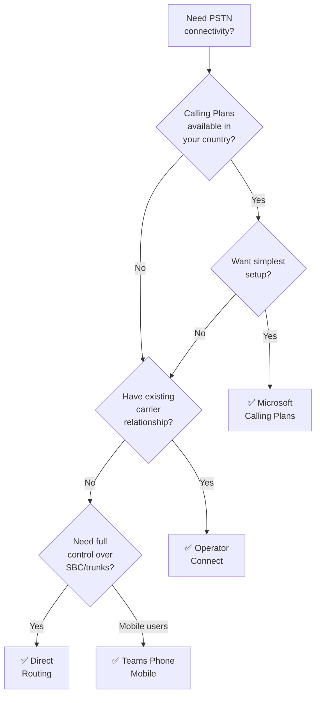
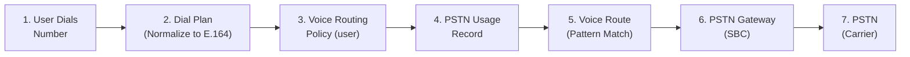

# 05 — Quick Reference Cheatsheet
> - 📁 [← Back to Home](/ms-721-study-notes/)
> - ⚡ **Purpose:** Last-minute review before the exam

---

## 🗺 Overview



---

## 🔢 Key Numbers to Remember

| Item | Value |
|------|-------|
| Exam passing score | **700 / 1000** |
| Exam duration | **100 minutes** |
| Teams meeting max attendees | **1,000** (20,000 view-only) |
| Webinar max attendees | **1,000** |
| Town hall max attendees | **10,000** (20,000 with Premium) |
| Teams Rooms Basic max rooms | **25 per tenant** |
| QoS Audio DSCP | **46 (EF)** |
| QoS Video DSCP | **34 (AF41)** |
| QoS App Sharing DSCP | **18 (AF21)** |
| Audio port range | **50000–50019** |
| Video port range | **50020–50039** |
| App sharing port range | **50040–50059** |
| SIP signaling port (Direct Routing) | **TLS 5061** |
| Media ports (STUN/TURN) | **UDP 3478–3481** |
| Call park default timeout | **300 seconds** |
| Voicemail max recording | **300 seconds** (default) |
| CQD data upload processing | **Up to 24 hours** |
| Recording auto-expiration | **120 days** (default, configurable) |

---

## 📞 PSTN Connectivity Decision Matrix



| Option | Best For | Complexity | SBC Needed? |
|--------|---------|-----------|-------------|
| **Calling Plans** | Small/mid orgs, quick setup | Low | No |
| **Operator Connect** | Existing carrier, managed SBC | Medium | No (operator) |
| **Direct Routing** | Large orgs, full control, any country | High | Yes |
| **Teams Phone Mobile** | Mobile-first users, single number | Low | No |

---

## 📜 Licensing Quick Reference

### User Licenses

| Scenario | Licenses Required |
|----------|------------------|
| User needs Teams Phone with Calling Plan | **Teams Phone Standard** + **Calling Plan** (or M365 E5 + Calling Plan) |
| User needs Teams Phone with Direct Routing | **Teams Phone Standard** (or M365 E5) — no Calling Plan needed |
| User needs Teams Phone with Operator Connect | **Teams Phone Standard** (or M365 E5) — operator provides connectivity |
| User needs Audio Conferencing | **Audio Conferencing** add-on (or M365 E5) |
| User needs Teams Premium features | **Teams Premium** add-on |
| Frontline worker with Shared Calling | **Teams Phone Standard** + **Shared Calling** policy |

### Device & Room Licenses

| Device Type | License |
|-------------|---------|
| Common area phone | **Common Area Phone** license |
| Teams Rooms (≤25 rooms) | **Teams Rooms Basic** (free) |
| Teams Rooms (unlimited + management) | **Teams Rooms Pro** |
| Resource account (AA/CQ) | **Teams Phone Resource Account** (free) |
| Resource account with phone number | + **Virtual User** or **Calling Plan** license |

### What M365 E5 Includes (vs. E3)

| Feature | E3 | E5 |
|---------|----|----|
| Teams Phone | ❌ | ✅ |
| Audio Conferencing | ❌ | ✅ |
| Teams Premium | ❌ | ❌ (separate add-on) |
| Calling Plans | ❌ | ❌ (separate add-on) |

---

## 🖥️ Admin Portals Quick Reference

| Task | Portal |
|------|--------|
| Create meeting policy | **Teams Admin Center** |
| Assign phone number to user | **Teams Admin Center** → Voice → Phone numbers |
| Create auto attendant | **Teams Admin Center** → Voice → Auto attendants |
| Create call queue | **Teams Admin Center** → Voice → Call queues |
| Assign license to user | **M365 Admin Center** |
| Configure Conditional Access for room accounts | **Microsoft Entra Admin Center** |
| View tenant-wide call quality | **Call Quality Dashboard** (cqd.teams.microsoft.com) |
| View per-user call analytics | **Teams Admin Center** → Users → select user |
| Monitor Teams Rooms | **Teams Rooms Pro Management portal** (portal.rooms.microsoft.com) |
| Manage device compliance | **Microsoft Intune** (intune.microsoft.com) |
| Manage SBC health | **Teams Admin Center** → Voice → Direct Routing |
| Configure bookable desks | **Microsoft Places** |

---

## ⌨️ Essential PowerShell Commands

### Phone Number Management

```powershell
# View phone number assignments
Get-CsPhoneNumberAssignment

# Assign number (Calling Plan)
Set-CsPhoneNumberAssignment -Identity user@domain.com -PhoneNumber "+14255551234" -PhoneNumberType CallingPlan

# Assign number (Direct Routing)
Set-CsPhoneNumberAssignment -Identity user@domain.com -PhoneNumber "+14255551234" -PhoneNumberType DirectRouting

# Remove number
Remove-CsPhoneNumberAssignment -Identity user@domain.com -PhoneNumber "+14255551234" -PhoneNumberType DirectRouting
```

### Direct Routing

```powershell
# Create SBC
New-CsOnlinePSTNGateway -Fqdn "sbc.domain.com" -SipSignalingPort 5061 -Enabled $true

# Create PSTN usage
Set-CsOnlinePstnUsage -Usage @{Add="US-Domestic"}

# Create voice route
New-CsOnlineVoiceRoute -Identity "US-Route" -NumberPattern "^\+1(\d{10})$" -OnlinePstnGatewayList "sbc.domain.com" -OnlinePstnUsages "US-Domestic"

# Create voice routing policy
New-CsOnlineVoiceRoutingPolicy -Identity "US-Policy" -OnlinePstnUsages "US-Domestic"

# Assign policy to user
Grant-CsOnlineVoiceRoutingPolicy -Identity user@domain.com -PolicyName "US-Policy"
```

### Auto Attendant & Call Queue

```powershell
# Create resource account (Auto Attendant)
New-CsOnlineApplicationInstance -UserPrincipalName aa@domain.com -DisplayName "Main AA" -ApplicationId "ce933385-9390-45d1-9512-c8d228074e07"

# Create resource account (Call Queue)
New-CsOnlineApplicationInstance -UserPrincipalName cq@domain.com -DisplayName "Sales CQ" -ApplicationId "11cd3e2e-fccb-42ad-ad00-878b93575e07"
```

### Policy Management

```powershell
# View all calling policies
Get-CsTeamsCallingPolicy

# Create custom calling policy
New-CsTeamsCallingPolicy -Identity "Restricted" -AllowPrivateCalling $true -AllowCallForwardingToPhone $false

# Assign policy to user
Grant-CsTeamsCallingPolicy -Identity user@domain.com -PolicyName "Restricted"

# Assign policy to group
New-CsGroupPolicyAssignment -GroupId "group-id" -PolicyType TeamsCallingPolicy -PolicyName "Restricted" -Rank 1
```

---

## 🔗 Voice Routing Chain (Direct Routing)



**Key rule:** Dial plans **normalize**. Voice routing policies **route**. These are two separate, sequential steps.

---

## 🚨 Emergency Calling Quick Reference

| Component | Purpose | Connectivity |
|-----------|---------|-------------|
| **Emergency address** | Physical civic address | All |
| **Place** | Floor/wing within address | All |
| **LIS** | Maps network → location | All (required for dynamic) |
| **Emergency calling policy** | Security desk notification | All |
| **Emergency call routing policy** | SBC routing for 911/112 | **Direct Routing only** |
| **Emergency dial mask** | Test number (e.g., 933) | Direct Routing |

---

## 🏢 Teams Rooms Decision Matrix

| Room Size | Platform | License | Key Peripherals |
|-----------|----------|---------|-----------------|
| Focus (1–2) | Teams display / personal device | N/A | Monitor, webcam |
| Small (2–6) | Android | Basic or Pro | Soundbar, touch console |
| Medium (6–12) | Windows or Android | Pro recommended | Camera, mics, display(s) |
| Large (12+) | Windows | Pro | PTZ camera, ceiling mics, dual displays, content camera |
| BYOD | N/A (user laptop) | Room mailbox only | Display, USB peripherals |

---

## ⚠️ Top Exam Traps

### Licensing Traps

| Trap | Correct Answer |
|------|---------------|
| "M365 E5 includes everything for calling" | **No** — E5 includes Teams Phone + Audio Conferencing, but NOT Calling Plans |
| "Teams Rooms Basic is free for all rooms" | **No** — limited to **25 rooms** per tenant |
| "Resource accounts for AA/CQ are always free" | **Free license**, but need **Calling Plan or Virtual User** license for a phone number |
| "Teams Premium is included in E5" | **No** — it's always a separate add-on |
| "Communication Credits are optional" | **Required** for toll-free numbers and international dial-out |

### Technical Traps

| Trap | Correct Answer |
|------|---------------|
| "Dial plans route calls" | **No** — dial plans only **normalize** numbers; voice routing policies route calls |
| "Media bypass works everywhere" | **No** — requires specific network topology (user and SBC on same network segment) |
| "SIP Gateway gives full Teams experience" | **No** — SIP devices get **basic** calling features only |
| "Content camera works on Android" | **No** — content camera is **Windows only** |
| "Proximity join uses Wi-Fi" | **No** — proximity join uses **Bluetooth** |
| "Emergency call routing policy is for all connectivity" | **No** — only for **Direct Routing**; Calling Plans/Operator Connect handle it automatically |

### Configuration Traps

| Trap | Correct Answer |
|------|---------------|
| "Room accounts need MFA" | They should be **excluded** from MFA policy with compensating controls |
| "GPO applies normally to Teams Rooms on Windows" | **No** — specific GPO exclusions are needed to avoid breaking the device |
| "Auto attendant Application ID = Call Queue Application ID" | **No** — they have different Application IDs |
| "Meeting policies apply to meetings" | Meeting policies are assigned to **users**, not meetings |
| "Webinar is a separate product" | **No** — webinar is a meeting type controlled by **meeting policies** |

---

## ✅ Pre-Exam Checklist

### Domain 1 — Plan & Design (20–25%)
- [ ] Can explain all PSTN connectivity options and when to use each
- [ ] Know meeting types (meeting, webinar, town hall, virtual appointment)
- [ ] Can design auto attendant/call queue call flows
- [ ] Understand emergency calling components (LIS, addresses, policies)
- [ ] Know Teams Rooms platform differences (Windows vs. Android)
- [ ] Can explain SBC requirements for Direct Routing
- [ ] Understand network assessment tools and QoS configuration

### Domain 2 — Meetings & Events (15–20%)
- [ ] Can configure meeting policies and meeting settings
- [ ] Know Audio Conferencing bridge setup and toll-free requirements
- [ ] Understand webinar vs. town hall differences
- [ ] Can configure eCDN for town halls
- [ ] Know Teams Premium features and licensing
- [ ] Understand recording storage (OneDrive vs. SharePoint)

### Domain 3 — Teams Phone (30–35%)
- [ ] Can configure dial plans with normalization rules
- [ ] Know the voice routing chain (dial plan → VRP → PSTN usage → voice route → SBC)
- [ ] Can create auto attendants and call queues with resource accounts
- [ ] Understand emergency calling configuration for all connectivity types
- [ ] Can assign phone numbers via Teams Admin Center and PowerShell
- [ ] Know Direct Routing SBC configuration requirements
- [ ] Can configure calling features (voicemail, forwarding, delegation, groups)

### Domain 4 — Rooms & Devices (20–25%)
- [ ] Know Teams Rooms Basic vs. Pro licensing and limits
- [ ] Can troubleshoot Conditional Access for room accounts
- [ ] Understand SkypeSettings.xml configuration for Windows rooms
- [ ] Know GPO exclusions needed for Teams Rooms on Windows
- [ ] Can configure SIP Gateway for legacy SIP phones
- [ ] Understand BYOD rooms and bookable desks in Microsoft Places
- [ ] Know optional features (content camera, proximity join, HDMI ingest)

---

## 📚 Last-Minute Resources

| Resource | Link |
|----------|------|
| MS-721 Study Guide | [Official Study Guide](https://learn.microsoft.com/en-us/credentials/certifications/resources/study-guides/ms-721) |
| Practice Assessment | [Free Practice Test](https://learn.microsoft.com/en-us/credentials/certifications/m365-collaboration-communications-systems-engineer/?practice-assessment-type=certification) |
| Teams Phone Docs | [Teams Phone](https://learn.microsoft.com/en-us/MicrosoftTeams/what-is-phone-system-in-office-365) |
| Direct Routing Docs | [Direct Routing](https://learn.microsoft.com/en-us/MicrosoftTeams/direct-routing-landing-page) |
| Teams Rooms Docs | [Teams Rooms](https://learn.microsoft.com/en-us/MicrosoftTeams/rooms/) |
| Emergency Calling | [Emergency Calling Docs](https://learn.microsoft.com/en-us/MicrosoftTeams/what-are-emergency-locations-addresses-and-call-routing) |

---

[← Previous: 04 — Teams Rooms & Devices](/ms-721-study-notes/04-teams-rooms-devices/){: .btn .btn-outline .fs-5 .mr-2 }

[🏠 Home](/ms-721-study-notes/){: .btn .btn-outline .fs-3 }
