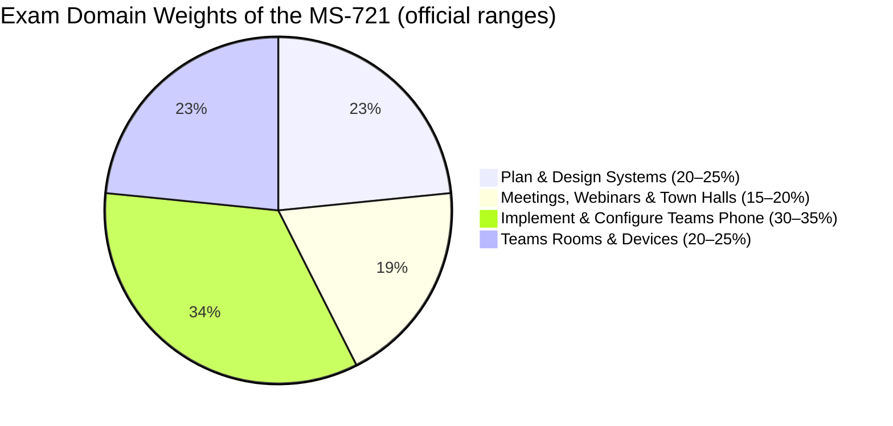
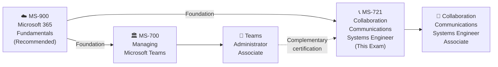

# 📘 MS-721: Collaboration Communications Systems Engineer
### Study Notes Repository 

[](https://github.com/marcogrimaldi29/ms-721-study-notes/actions/workflows/pages.yml)
[](https://github.com/marcogrimaldi29/ms-721-study-notes)
[](https://marcogrimaldi29.com)

> - 🎯 **Goal:** Earn the Microsoft 365 Certified: Collaboration Communications Systems Engineer Associate badge
> - 📅 **Notes Version:** 2026
> - 🌐 **Published site:** [📘 MS-721 Study Notes](https://marcogrimaldi29.com/ms-721-study-notes/)
> - ✍️ **Author:** [Marco Grimaldi](https://www.linkedin.com/in/marco-grimaldi29/)
> - 🛬 **Main Landing Page:** [🛬 Landing Page: Study Notes](https://marcogrimaldi29.com/study-notes/)
---

## 📋 Exam At-a-Glance

| Detail | Info |
|--------|------|
| 🏅 Certification | Microsoft 365 Certified: Collaboration Communications Systems Engineer Associate |
| 📝 Passing Score | **700 / 1000** |
| 💶 Exam Price | **~€126 EUR** *(varies by EU country & Pearson VUE location; VAT may apply)* |
| ⏱️ Duration | **~100 minutes** |
| ❓ Question Types | MCQ, multi-select, drag-and-drop, case studies |
| 🔁 Renewal | **Annual** via free online assessment on Microsoft Learn |
| 🛡️ Prerequisite | None *(recommended: familiarity with Teams admin, networking, telephony, and meeting room devices)* |

---

## 📊 Official Domain Breakdown

> ⚠️ **Official ranges** from the Microsoft study guide (updated April 2026)



| # | Domain | Official Weight | Key Topics |
|---|--------|----------------|------------|
| 1 | Plan & Design Collaboration Communications Systems | **20–25%** | Meetings design, Teams Phone & PSTN, certified devices, network readiness |
| 2 | Configure & Manage Teams Meetings, Webinars & Town Halls | **15–20%** | Meeting policies, Audio Conferencing, webinars, town halls |
| 3 | Implement & Configure Teams Phone | **30–35%** | Phone policies, auto attendants, call queues, emergency calling, Direct Routing |
| 4 | Configure & Manage Teams Rooms & Devices | **20–25%** | Teams Rooms (Windows/Android), device management, BYOD spaces, bookable desks |

> 🔑 **Domain 3 (Teams Phone) = heaviest domain** — allocate ≥30% of total study time here.

---

## 🗺 Certification Path



> 💡 **MS-721** focuses on **Teams Phone, meetings infrastructure, and certified devices** (SBCs, Teams Rooms, call quality). **[MS-700](https://learn.microsoft.com/en-us/credentials/certifications/m365-teams-administrator-associate/)** focuses on **Teams administration** (policies, governance, compliance). Together they cover the full Microsoft Teams certification spectrum.

---

## 🗂️ Repository Structure

```
ms-721-study-notes/
├── README.md                             ← 📍 You are here
├── 00-teams-voice-fundamentals.md        ← Core Teams voice & communications concepts
├── 01-plan-design-systems.md             ← Domain 1 (20–25%)
├── 02-meetings-webinars-townhalls.md     ← Domain 2 (15–20%)
├── 03-teams-phone.md                     ← Domain 3 (30–35%)
├── 04-teams-rooms-devices.md             ← Domain 4 (20–25%)
└── 05-quick-reference-cheatsheet.md      ← Last-minute review & exam traps
```

---

## 📚 Official Learning Resources

| Resource | Link |
|----------|------|
| 📚 Microsoft's MS-721 Certification Page | [Certification Page](https://learn.microsoft.com/en-us/credentials/certifications/m365-collaboration-communications-systems-engineer/) |
| 📋 Skills Measured / Study Guide | [Official Study Guide](https://learn.microsoft.com/en-us/credentials/certifications/resources/study-guides/ms-721) |
| 🧪 Free Practice Assessment | [Practice Assessment](https://learn.microsoft.com/en-us/credentials/certifications/m365-collaboration-communications-systems-engineer/?practice-assessment-type=certification) |
| 📖 MS-721T00 Training Course | [Instructor-Led Course](https://learn.microsoft.com/en-us/training/courses/ms-721t00) |
| 📄 Microsoft Teams Admin Documentation | [Teams Admin Docs](https://learn.microsoft.com/en-us/MicrosoftTeams/) |
| 🎬 Exam Readiness Videos | [Exam Readiness Zone](https://learn.microsoft.com/en-us/shows/exam-readiness-zone/) |
| 💶 EU Exam Pricing | [Pearson VUE Microsoft](https://home.pearsonvue.com/microsoft) |

---

### ✅ Key Study Tips

- 🎯 The exam tests **engineering-level design and configuration** — think call flows, SBC architecture, and device provisioning
- 📞 **Teams Phone is ~1/3 of the exam** — Direct Routing, Operator Connect, dial plans, and voice routing are critical
- 🏢 Know **Teams Rooms** differences: Windows vs. Android, Basic vs. Pro licensing, resource accounts
- 🌐 Understand **PSTN connectivity options** — Calling Plans vs. Operator Connect vs. Direct Routing
- 📐 Study **auto attendant and call queue design** — call flows, business hours, holiday routing
- 🚨 **Emergency calling** (dynamic locations, LIS, routing policies) is heavily tested
- 📊 Know **Call Quality Dashboard (CQD)**, Call Analytics, and network assessment tools
- 📖 For scenario questions: identify the **correct connectivity method** and **licensing requirement** first

---

## ⚡ Quick Navigation

| File | Topics Covered |
|------|---------------|
| [📘 00 — Teams Voice Fundamentals](./00-teams-voice-fundamentals.md) | Teams Phone architecture, PSTN connectivity, licensing, admin portals |
| [🔧 01 — Plan & Design Systems](./01-plan-design-systems.md) | Meeting design, Teams Phone planning, certified devices, network readiness |
| [🎥 02 — Meetings, Webinars & Town Halls](./02-meetings-webinars-townhalls.md) | Meeting policies, Audio Conferencing, webinars, town halls |
| [📞 03 — Teams Phone](./03-teams-phone.md) | Phone policies, auto attendants, call queues, emergency calling, Direct Routing |
| [🏢 04 — Teams Rooms & Devices](./04-teams-rooms-devices.md) | Teams Rooms, Android devices, Windows rooms, BYOD, bookable desks |
| [⚡ 05 — Quick Reference Cheatsheet](./05-quick-reference-cheatsheet.md) | Key numbers, decision tables, exam traps, final checklist |

---

## 📚 About the Study Notes

These notes are hosted on **GitHub Pages** and published as a searchable website on this URL:

👉 **[📘 MS-721 Study Notes](https://marcogrimaldi29.com/ms-721-study-notes/)**

The site includes full-text search, Mermaid diagram rendering, and mobile-friendly navigation for on-the-go review. 

These notes are designed to be a structured, exam-focused summary of the most important concepts and services based on the official [Microsoft MS-721 Study Guide](https://learn.microsoft.com/en-us/credentials/certifications/resources/study-guides/ms-721) and its criteria.

Additional study notes maintained by me are also available for those pursuing Microsoft and Azure certifications at the following Landing Page:

👉 **[🛬 Landing Page: Study Notes](https://marcogrimaldi29.com/study-notes/)**

---

## ✍️ About the Author

Maintained by **[Marco Grimaldi](https://www.linkedin.com/in/marco-grimaldi29/)** — Cloud Consultant, Language Trainer & Lifelong Learner.

🏠 Find more certification guides, study tips, and tech content at **[🌐 marcogrimaldi29.com](https://marcogrimaldi29.com)**

The site is continuously updated and based on my personal study notes and experiences. If you have any feedback, suggestions, or corrections, feel free to [reach out](https://marcogrimaldi29.com/contact/)!

---

## 📈 Analytics

This site uses **[Umami](https://umami.is/)** for privacy-friendly analytics.

---

## ⭐ Found These Notes Helpful?

If these notes have helped you prepare for the MS-721 exam, consider giving the repo a **star** — it helps others find these resources and makes the effort of keeping them up-to-date worthwhile. Thank you! 🙌

---

## ©️ Credits & Acknowledgements

The **[Just the Docs](https://github.com/just-the-docs/just-the-docs)** theme is used for a clean, documentation-style layout. Licensed under [MIT](https://opensource.org/license/MIT).

Created with the help of AI. Model used: **[Claude Opus 4.6](https://www.anthropic.com/)**. The content has been reviewed and edited by the author for accuracy and clarity, but may contain errors. Always verify against the latest [Microsoft documentation](https://learn.microsoft.com/en-us/MicrosoftTeams/).

> *Not affiliated with or endorsed by Microsoft.*

---
