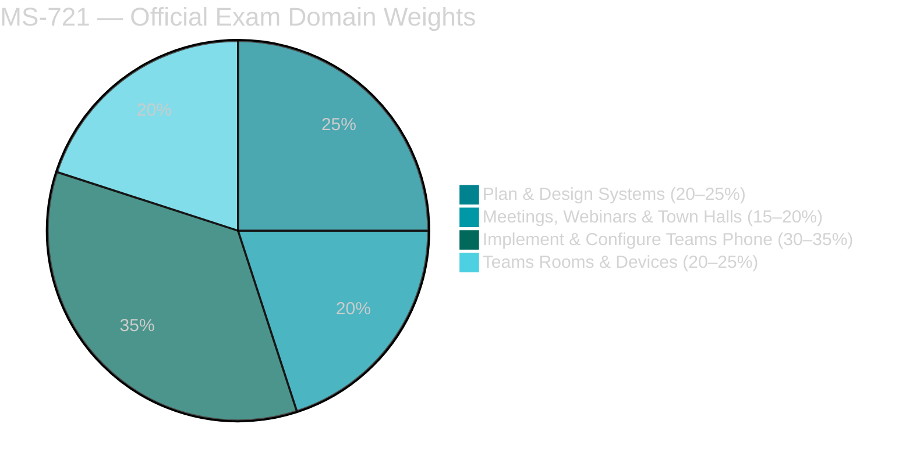
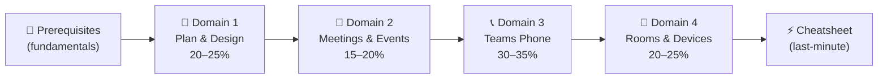

# 📘 MS-721 Study Notes
{: .no_toc }

**Microsoft 365 Certified: Collaboration Communications Systems Engineer Associate**
{: .fs-5 .fw-300 }

[Start Studying →](/ms-721-study-notes/00-teams-voice-fundamentals){: .btn .btn-primary .fs-5 .mb-4 .mb-md-0 .mr-2 }
[View on GitHub](https://github.com/marcogrimaldi29/ms-721-study-notes){: .btn .fs-5 .mb-4 .mb-md-0 target="_blank" }

---

> These notes are maintained by **[Marco Grimaldi](https://www.linkedin.com/in/marco-grimaldi29/)** and based on the **[official Microsoft documentation](https://learn.microsoft.com/en-us/credentials/certifications/m365-collaboration-communications-systems-engineer/)**.
> Find more certification guides, study tips, and tech content at **[🏠 marcogrimaldi29.com](https://marcogrimaldi29.com)**.
> *Not affiliated with or endorsed by Microsoft. Always verify against the latest Microsoft documentation.*

---

## 🎯 Exam Overview

| Detail | Value |
|--------|-------|
| 🏅 Certification | **Microsoft 365 Certified: Collaboration Communications Systems Engineer Associate** |
| 📝 Passing Score | **700 / 1000** |
| 💶 Price (EU) | **~€126** *(varies by country, VAT may apply)* |
| ⏱️ Duration | **~100 minutes** |
| 🔁 Renewal | **Annual** — free online assessment on Microsoft Learn |
| 🛡️ Prerequisite | **None** *(Teams admin, networking & telephony experience recommended)* |

---

## 📊 Domain Weights

| # | Domain | Weight | Key Focus Areas |
|---|--------|--------|----------------|
| 1 | [Plan & Design Collaboration Communications Systems](./01-plan-design-systems/) | **20–25%** | Meetings design, Teams Phone & PSTN planning, certified devices, network readiness |
| 2 | [Configure & Manage Meetings, Webinars & Town Halls](./02-meetings-webinars-townhalls/) | **15–20%** | Meeting policies, Audio Conferencing, webinars, town halls |
| 3 | [Implement & Configure Teams Phone](./03-teams-phone/) | **30–35%** | Phone policies, auto attendants, call queues, emergency calling, Direct Routing |
| 4 | [Configure & Manage Teams Rooms & Devices](./04-teams-rooms-devices/) | **20–25%** | Teams Rooms (Windows/Android), device management, BYOD spaces, bookable desks |

---

## 🗂️ Notes Index

<h3 style="margin-top:0;">📘 Prerequisites</h3>

Core Teams voice & communications concepts: Teams Phone architecture, PSTN connectivity options, licensing, admin portals, and network fundamentals.

<a href="./00-teams-voice-fundamentals/" class="btn btn-outline fs-5">Read →</a>

<h3 style="margin-top:0;">🔧 Domain 1 — Plan & Design</h3>

<strong>20–25%</strong> of exam. Meeting design, Teams Phone & PSTN planning, certified devices, network readiness.

<a href="./01-plan-design-systems/" class="btn btn-outline fs-5">Read →</a>

<h3 style="margin-top:0;">🎥 Domain 2 — Meetings & Events</h3>

<strong>15–20%</strong> of exam. Meeting policies, Audio Conferencing, webinars, town halls, Teams Premium features.

<a href="./02-meetings-webinars-townhalls/" class="btn btn-outline fs-5">Read →</a>

<h3 style="margin-top:0;">📞 Domain 3 — Teams Phone</h3>

<strong>30–35%</strong> of exam. Phone policies, auto attendants, call queues, emergency calling, Direct Routing, voice routing.

<a href="./03-teams-phone/" class="btn btn-outline fs-5">Read →</a>

<h3 style="margin-top:0;">🏢 Domain 4 — Rooms & Devices</h3>

<strong>20–25%</strong> of exam. Teams Rooms on Windows/Android, device management, SIP devices, BYOD, bookable desks.

<a href="./04-teams-rooms-devices/" class="btn btn-outline fs-5">Read →</a>

<h3 style="margin-top:0;">⚡ Quick Reference Cheatsheet</h3>

Key numbers, admin portals, policy comparison tables, PowerShell commands, exam traps, and pre-exam checklist.

<a href="./05-quick-reference-cheatsheet/" class="btn btn-outline fs-5">Read →</a>

---

## 🧠 How to Use These Notes

These notes are structured to follow the **official MS-721 study guide** domain order. The recommended reading flow:

### 💡 Study Tips

- 🎯 The exam tests **engineering-level design and configuration** — think call flows, SBC architecture, and device provisioning
- 📞 **Teams Phone is ~1/3 of the exam** — Direct Routing, Operator Connect, dial plans, and voice routing are critical
- 🏢 Know **Teams Rooms** differences: Windows vs. Android, Basic vs. Pro, resource accounts
- 🌐 Understand **PSTN connectivity** — Calling Plans vs. Operator Connect vs. Direct Routing
- ⚠️ Each section has **`Exam Caveats`** callouts — these are high-frequency exam traps
- 🚨 **Emergency calling** configuration is a significant exam topic — know dynamic locations and LIS

---

## 📄 Official Resources

| Resource | Link |
|----------|------|
| 🎓 Microsoft Certification Page | [MS-721 Certification](https://learn.microsoft.com/en-us/credentials/certifications/m365-collaboration-communications-systems-engineer/) |
| 📋 Skills Measured Guide | [Official Study Guide](https://learn.microsoft.com/en-us/credentials/certifications/resources/study-guides/ms-721) |
| 🧪 Free Practice Assessment | [Practice Assessment](https://learn.microsoft.com/en-us/credentials/certifications/m365-collaboration-communications-systems-engineer/?practice-assessment-type=certification) |
| 📖 Training Course | [MS-721T00](https://learn.microsoft.com/en-us/training/courses/ms-721t00) |
| 📄 Teams Admin Docs | [Teams Documentation](https://learn.microsoft.com/en-us/MicrosoftTeams/) |
| 💶 EU Exam Booking | [Pearson VUE Microsoft](https://home.pearsonvue.com/microsoft) |

---

## 📚 About the Study Notes

The site includes full-text search, Mermaid diagram rendering, and mobile-friendly navigation for on-the-go review. 

These notes are designed to be a structured, exam-focused summary of the most important concepts and services based on the official **[Microsoft MS-721 Study Guide](https://learn.microsoft.com/en-us/credentials/certifications/resources/study-guides/ms-721)** and its criteria.

Additional study notes maintained by me are also available for those pursuing Microsoft and Azure certifications at the following Landing Page:

👉 **[🛬 Landing Page: Study Notes](https://marcogrimaldi29.com/study-notes/)**

---

## ✍️ About the Author

These notes are maintained by **[Marco Grimaldi](https://www.linkedin.com/in/marco-grimaldi29/)** — Cloud Consultant, Language Trainer & Lifelong Learner.

📍 **Find more content at [🏠 marcogrimaldi29.com](https://marcogrimaldi29.com)**

> The website is continuously updated and based on my personal study notes and experiences. If you have any feedback, suggestions, or corrections, feel free to [reach out](https://marcogrimaldi29.com/contact/)!

---

## 📈 Analytics

This site uses **[Umami](https://umami.is/)** for privacy-friendly analytics.

---

## ⭐ Found These Notes Helpful?

If these notes have helped you prepare for the MS-721 exam, consider giving the repo a **star on GitHub** — it helps others find these resources and makes the effort of keeping them up-to-date worthwhile. Thank you! 🙌

[⭐ Star this repo](https://github.com/marcogrimaldi29/ms-721-study-notes){: .btn .btn-outline .fs-5 .mb-4 .mb-md-0 }

---

## ©️ Credits & Acknowledgements

The **[Just the Docs](https://github.com/just-the-docs/just-the-docs)** theme is used for a clean, documentation-style layout. Licensed under [MIT](https://opensource.org/license/MIT).

Created with the help of AI. Model used: **[Claude Opus 4.6](https://www.anthropic.com/)**. The content has been reviewed and edited by the author for accuracy and clarity, but may contain errors. Always verify against the latest [Microsoft documentation](https://learn.microsoft.com/en-us/MicrosoftTeams/).

> *Not affiliated with or endorsed by Microsoft.*
